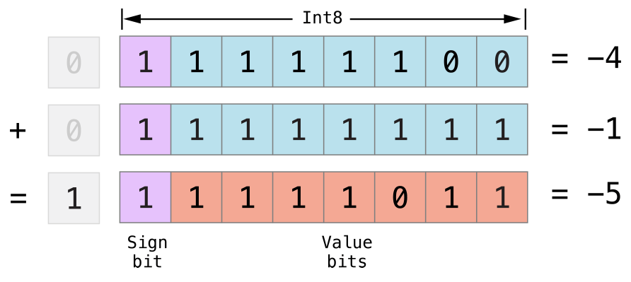
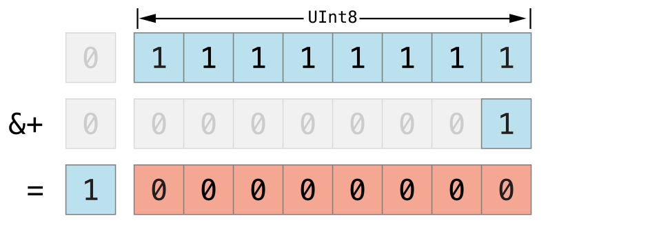
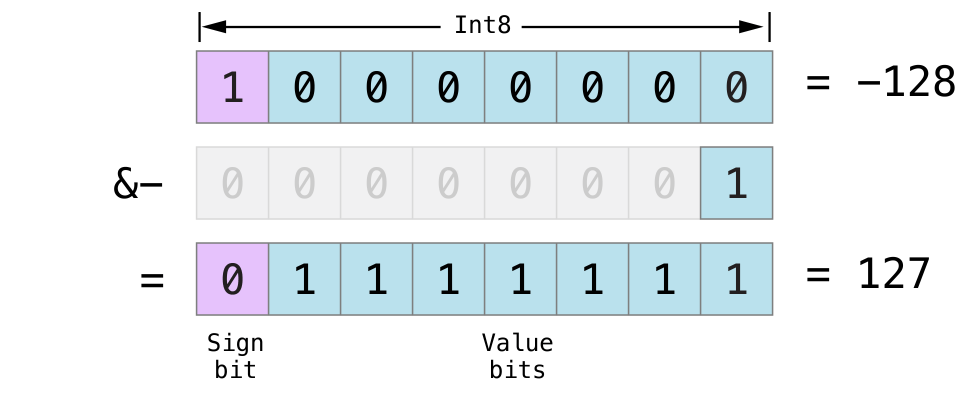

# Advanced Operators

最終更新日:

[Basic Operators](./basic-operators.md)で説明されている演算子に加えて、Swift は、より複雑な値操作を実行するいくつかの高度な演算子を提供します。これらには、C 言語および Objective-C でおなじみの全てのビット単位およびビットシフト演算子が含まれます。

C 言語の算術演算子とは異なり、Swift の算術演算子はデフォルトでオーバーフローしません。オーバーフロー動作はトラップされ、エラーとして報告されます。オーバーフロー動作を選択するには、オーバーフロー加算演算子(`&+`)など、デフォルトでオーバーフローする Swift の 2 番目の算術演算子セットを使用します。これらのオーバーフロー演算子は全て、アンパサンド(`&`)で始まります。

独自の構造体、クラス、および列挙型を定義する場合、これらの独自型に標準の Swift 演算子の独自の実装を提供すると便利な場合があります。Swift では、簡単にこれらの演算子のカスタマイズ実装を提供し、作成した型ごとにそれらの動作を正確に決めることができます。

事前定義された演算子に限定されません。Swift では、独自の優先順位と結合規則を使用して、独自の前置、中置、後置、および代入演算子を自由に定義できます。これらの演算子は、事前定義の演算子と同様にコードで使用および適用でき、定義した独自の演算子をサポートするように既存の型を拡張することもできます。

## Bitwise Operators(ビット演算子)

ビットごとの演算子を使用すると、データ構造内の個々の生データビットを操作できます。これらは、グラフィクスプログラミングやデバイスドライバーの作成など、低レベルのプログラミングでよく使用されます。ビットごとの演算子は、独自のプロトコルを介した通信用データのエンコードおよびデコードなど、外部ソースからの生データを操作する場合にも役立ちます。

Swift は、下記で説明するように、C 言語に見られる全てのビット演算子をサポートしています。

### Bitwise NOT Operator(ビットNOT演算子)

ビット NOT 演算子(`~`)は、数値の全てのビットを反転します。


ビット NOT 演算子は前置演算子で、空白を含めずに演算対象の値の直前に置きます。

```swift
let initialBits: UInt8 = 0b00001111
let invertedBits = ~initialBits  // 11110000 と等しい
```

`UInt8` 整数には 8 ビットの、`0` から `255` までの任意の値を格納できます。この例では、`UInt8` 整数をバイナリ値 `00001111` で初期化し、最初の 4 ビットが `0` に設定され、2 番目の 4 ビットが `1` に設定されています。これは、10 進数の `15` に相当します。

次に、ビット NOT 演算子を使用して、`invertedBits` と呼ばれる新しい定数を作成します。これは `initialBits` と同じですが、全てのビットが反転されています。0 は 1 になり、1 は 0 になります。`invertedBits` の値は `11110000` で、符号なし 10 進数の `240` に相当します。

### Bitwise AND Operator(ビットAND演算子)

ビット AND 演算子(`&`)は、2 つの数値のビットを合成します。両方の入力数値のビットが 1 の場合にのみ、ビットが 1 になり、新しい数値を返します:


下記の例では、`firstSixBits` と `lastSixBits` の値は両方とも、4 つの中間ビットに `1` が設定されています。ビット AND 演算子はそれらを組み合わせて、符号なし 10 進数の `60` に等しい数値 `00111100` を作成します。

```swift
let firstSixBits: UInt8 = 0b11111100
let lastSixBits: UInt8  = 0b00111111
let middleFourBits = firstSixBits & lastSixBits  // 00111100 と等しい
```

### Bitwise OR Operator(ビットOR演算子)

ビット OR 演算子(`|`)は、2 つの数値のビットを比較します。演算子は、いずれかの入力数値のビットが `1` に等しい場合、ビットは `1` になり、新しい数値を返します:


下記の例では、`someBits` と `moreBits` の値の異なるビットに `1` が設定されています。ビットごとの OR 演算子はそれらを組み合わせて、符号なし 10 進数の `254` に等しい `11111110` という数値を作成します。

```swift
let someBits: UInt8 = 0b10110010
let moreBits: UInt8 = 0b01011110
let combinedbits = someBits | moreBits  // 11111110 と等しい
```

### Bitwise XOR Operator(ビットXOR演算子)

ビット XOR 演算子、つまり「排他的論理和演算子」(`^`)は、2 つの数値のビットを比較します。演算子は、入力ビットが異なる場合はビットに `1` が設定され、入力ビットが同じ場合は `0` が設定される新しい数値を返します:


下記の例では、`firstBits` と `otherBits` の値はそれぞれ、他の場所にはないビットに `1` が設定されています。ビット XOR 演算子は、これらのビット両方に `1` を設定します。`firstBits` および `otherBits` の他の全てのビットは値が一致しているので、`0` が設定されます。

```swift
let firstBits: UInt8 = 0b00010100
let otherBits: UInt8 = 0b00000101
let outputBits = firstBits ^ otherBits  // 00010001 と等しい
```

### Bitwise Left and Right Shift Operators(ビット左右シフト演算子)

ビット左シフト演算子(`<<`)およびビット右シフト演算子(`>>`)は、下記で定義されている規則に従って、数値内の全てのビットを特定の桁数だけ左または右に移動します。

ビット左シフトと右シフトには、整数を 2 倍に乗算または除算する効果があります。整数のビットを 1 桁左にシフトするとその値は 2 倍になり、1 桁右にシフトすると値は半分になります。

#### Shifting Behavior for Unsigned Integers(符号なし整数のシフト演算)

---

符号なし整数のビットシフト動作は次のとおりです。

1. 既存のビットは、要求された桁数だけ左または右に移動します
2. 整数のストレージの境界を超えて移動したビットは全て破棄されます
3. 元のビットを左または右に移動した後に残ったスペースに 0 が挿入されます

このアプローチは、論理シフト(*logical shift*)として知られています。

下の図は、`11111111 << 1`(`11111111` を 1 桁左にずらしたもの)と `11111111 >> 1`(`11111111` を右に 1 桁ずらしたもの)の結果を示しています。青色の数字はシフトされ、灰色の数字は破棄され、オレンジ色のには 0 が挿入されます。


Swift コードでのビットシフトの様子は次のとおりです:

```swift
let shiftBits: UInt8 = 4   // バイナリ内の 00000100
shiftBits << 1             // 00001000
shiftBits << 2             // 00010000
shiftBits << 5             // 10000000
shiftBits << 6             // 00000000
shiftBits >> 2             // 00000001
```

ビットシフトを使用して、他のデータ型内の値をエンコードおよびデコードできます:

```swift
let pink: UInt32 = 0xCC6699
let redComponent = (pink & 0xFF0000) >> 16    // redComponent は 0xCC または 204
let greenComponent = (pink & 0x00FF00) >> 8   // greenComponent は 0x66 または 102
let blueComponent = pink & 0x0000FF           // blueComponent は 0x99 または 153
```

この例では、`pink` という `UInt32` 定数を使用して、ピンク色の CSS 値を格納します。CSS カラー値 `#CC6699` は、Swift の 16 進数で `0xCC6699` になります。次に、この色は、ビット AND 演算子(`&`)とビット右シフト演算子(`>>`)によって、赤(`CC`)、緑(`66`)、および青(`99`)のコンポーネントに分解されます。

赤のコンポーネントは、数値 `0xCC6699` と `0xFF0000` の間でビット AND 演算をすることによって取得されます。`0xFF0000` の 0 は、`0xCC6699` の 2 番目と 3 番目のバイトを効果的に「マスク」し、`6699` を無視して、結果として `0xCC0000` を残します。

次に、この番号が 16 桁右にシフトされます(`>> 16`)。16 進数の文字の各ペアは 8 ビットを使用するため、16 桁右に移動すると、`0xCC0000` が `0x0000CC` に変換されます。これは、10 進数 `204`、 `0xCC` と同じです。

同様に、緑のコンポーネントは、数値 `0xCC6699` と `0x00FF00` の間でビット AND 演算をすることによって取得され、`0x006600` の出力値が得られます。次に、この出力値が 8 桁右にシフトされ、10 進数 `102`、`0x66` が得られます。

最後に、青のコンポーネントは、数値 `0xCC6699` と `0x0000FF` の間でビット AND 演算をすることによって取得され、`0x000099` の出力値が得られます。`0x000099` はすでに 10 進数 `153`、 `0x99` に等しいため、この値は右にシフトせずに使用されます。

#### Shifting Behavior for Signed Integers(符号あり整数のシフト演算)

---

符号付き整数のシフト演算は、符号なし整数よりも符号付き整数の方が複雑です。これは、符号付き整数がバイナリで表現される方法に由来します。(下記の例は、簡単にするために 8 ビットの符号付き整数に基づいていますが、同じ原則が任意のサイズの符号付き整数に適用されます)

符号付き整数は、最初のビット(符号ビット(*sign bit*)と呼ばれます)を使用して、整数が正か負かを示します。符号ビット `0` は正を意味し、符号ビット `1` は負を意味します。

残りのビット(値ビット(*value bits*)と呼ばれます)には、実際の値が格納されています。正の数は、符号なし整数の場合とまったく同じ方法で、`0` から数えて格納されています。`Int8` 内からビットで数値 `4` を表す方法は次のとおりです:


符号ビットは `0`(「正」を意味します)で、7 つの値ビットは 2 進数表記で書かれた数字の `4` です。

ただし、負の数は別の方法で格納されます。それらは、`2` から `n` のべき乗の絶対値を引くことによって保持されます。ここで、`n` は値のビット数です。8 ビットの数値には 7 つの値ビットがあるため、これは 2 の 7 乗、つまり `128` を意味します。

`Int8` 内からビットで数値 `-4` を表す方法は次のとおりです:


今回は、符号ビットは `1`(「負」を意味する)で、7 つの値ビットは `124` のバイナリ値(`128 - 4`)です:


負の数のこのエンコーディングは、2 の補数表現(*complement representation*)と呼ばれています。負の数を表すのは珍しい方法に見えるかもしれませんが、いくつかの利点があります。

まず、8 ビット全て(符号ビットを含む)の標準の 2 進数加算を実行し、完了したら 8 ビットに収まらないものは全て破棄するだけで、`-1` を `-4` に加算できます:



次に、2 の補数表現では、負の数のビットを正の数のように左右にシフトすることもできますが、左にシフトするたびにビットを 2 倍し、右にシフトするたびにビットを半分にします。これを実現するために、符号付き整数を右にシフトするときに追加の規則が使用されます。符号付き整数を右にシフトするときは、符号なし整数と同じ規則を適用しますが、左側の空のビットを 0 で埋めるのではなく、符号ビットで埋めます。


このアクションにより、符号付き整数が右にシフトされた後も同じ符号を持つようになります。これは算術シフト(*arithmetic shift*)と呼ばれています。

正の数と負の数は特殊な方法で保持されるため、どちらかを右にシフトすると 0 に近づきます。このシフト中に符号ビットを同じに保つということは、値が 0 に近づいても負の整数は負の値のままになることを意味します。

## Overflow Operators(オーバーフロー演算子)

その値を保持できない整数定数または変数に数値を挿入しようとすると、デフォルトで、Swift は無効な値の作成せず、エラーを報告します。この動作により、大きすぎたり小さすぎたりする数値を処理するときの安全性がさらに高まります。

例えば、`Int16` 整数型は、`-32768` から `32767` までの任意の符号付き整数を保持できます。`Int16` の定数または変数にこの範囲外の数値に設定しようとすると、エラーが発生します。

```swift
var potentialOverflow = Int16.max
// potentialOverflow は 32767 に等しく、これは Int16 が保持できる最大値です
potentialOverflow += 1
// これによりエラーが発生します
```

値が大きすぎたり小さすぎたりした場合のエラー処理を提供すると、境界値条件をコーディングする際の柔軟性が大幅に向上します。

ただし、オーバーフロー条件で使用可能なビット数を切り捨てる必要がある場合は、エラーをトリガーするのではなく、この動作を選択できます。Swift は、整数計算のオーバーフロー動作を選択する 3 つの算術オーバーフロー演算子(*overflow operator*)を提供します。これらの演算子は全てアンパサンド(`&`)で始まります。

* オーバーフロー加算(`&+`)
* オーバーフロー減算(`&-`)
* オーバーフロー乗算(`&*`)

### Value Overflow(値のオーバーフロー)

数値は、正の方向と負の方向の両方でオーバーフローする可能性があります。

オーバーフロー加算演算子(`&+`)を使用して、符号なし整数を正の方向にオーバーフローさせた場合の例を次に示します:

```swift
var unsignedOverflow = UInt8.max
// unsignedOverflow は 255 に等しく、これは UInt8 が保持できる最大値です
unsignedOverflow = unsignedOverflow &+ 1
// unsignedOverflow は現在 0 に等しい
```

変数 `unsignedOverflow` は、`UInt8` が保持できる最大値(`255`、またはバイナリで `11111111`)で初期化されます。次に、オーバーフロー加算演算子(`&+`)を使用して 1 ずつインクリメントします。これにより、`UInt8` が保持できるサイズを超えてそのバイナリ表現がプッシュされ、下の図に示すように、境界を超えてオーバーフローします。オーバーフロー加算後に `UInt8` の境界内に残っている値は `00000000`、つまり `0` です:



符号なし整数が負の方向にオーバーフローできる場合にも、同様のことが起こります。オーバーフロー減算演算子(`&-`)を使用した例を次に示します:

```swift
var unsignedOverflow = UInt8.min
// unsignedOverflow は 0 に等しく、UInt8 が保持できる最小値です
unsignedOverflow = unsignedOverflow &- 1
// unsignedOverflow は 255 になりました
```

`UInt8` が保持できる最小値は `0`、つまりバイナリで `00000000` です。オーバーフロー減算演算子(`&-`)を使用して `00000000` から `1` を減算すると、数値はオーバーフローして `11111111`、つまり 10 進数で `255` に巻き戻ります。


オーバーフローは、符号付き整数でも発生します。符号付き整数の加算と減算は全てビット単位で実行され、[Bitwise Left and Right Shift Operators](#bitwise-left-and-right-shift-operatorsビット左右シフト演算子)で説明されているように、加算または減算される数値の一部として符号ビットが含まれます。

```swift
var signedOverflow = Int8.min
// signedOverflow は -128 に等しく、これは Int8 が保持できる最小値です
signedOverflow = signedOverflow &- 1
// signedOverflow は 127 になりました
```

`Int8` が保持できる最小値は `-128`、つまりバイナリで `10000000` です。オーバーフロー演算子を使用してこの 2 進数から `1` を減算すると、`01111111` のバイナリ値が得られます。これは、符号ビットを切り替えて、`Int8` が保持できる正の最大値 `127` を返します。



符号付き整数と符号なし整数の両方で、正の方向のオーバーフローは有効な整数値の最大値から最小値に巻き戻り、負の方向のオーバーフローは最小値から最大値に巻き戻ります。

## Precedence and Associativity(優先順位と結合規則)

演算子の優先順位(*precedence*)により、一部の演算子は他の演算子よりも優先されます。これらの演算子は最初に適用されます。

演算子の結合規則(*associativity*)は、同じ優先順位の演算子をグループ化する方法(左からグループ化するか、右からグループ化するか)を定義します。「それらは左側の表現に関連する」または「それらは右側の表現に関連する」という意味だと考えてください。

複合式が計算される順序を決めるときは、各演算子の優先順位と結合規則を考慮することが重要です。例えば、演算子の優先順位は、次の式が `17` に等しい理由を説明しています。

```swift
2 + 3 % 4 * 5
// これは 17 に等しい
```

左から右に厳密に読むと、式は次のように計算されると予想できます。

* `2` 足す `3` は `5` に等しい
* `5` 割る `4` の余りは `1` に等しい
* `1` かける `5` は `5` に等しい

ただし、実際の答えは `5` ではなく `17` です。優先順位の高い演算子は、優先順位の低い演算子の前に評価されます。Swift では、C 言語と同様に、剰余演算子(`%`)と乗算演算子(`*`)が加算演算子(`+`)よりも優先されます。その結果、加算される前に両方が評価されます。

ただし、剰余と乗算の優先順位は互いに同じです。使用する正確な評価順序を決定するには、それらの結合規則も考慮する必要があります。剰余と乗算はどちらも、左側の式に関連付けられています。これは、式のこれらの部分の左から始めて、暗黙の括弧(`()`)を追加することと考えてください。

```swift
2 + ((3 % 4) * 5)
```

`(3 % 4)` は `3` なので、これは次と等価です。

```swift
2 + (3 * 5)
```

`(3 * 5)` は `15` なので、これは次と等価です。

```swift
2 + 15
```

この計算により、最終的な答えは `17` になります。

演算子の優先順位グループと結合規則設定の完全なリストを含む、Swift 標準ライブラリが提供する演算子については、[Operator Declarations](https://developer.apple.com/documentation/swift/swift_standard_library/operator_declarations)を参照ください。

> NOTE  
> Swift の演算子の優先順位と結合規則は、C 言語や Objective-C にあるものよりもシンプルで予測可能です。ただし、これは、C 言語ベースの言語とまったく同じではないことを意味します。既存のコードを Swift に移植するときは、オペレーターの作用が意図したとおりに動作するかを確認してください。

## Operator Methods(演算子メソッド)

クラスと構造体は、既存の演算子の独自の実装を提供できます。これは、既存の演算子のオーバーロードとして知られています。

下記の例は、独自の構造体に算術加算演算子(`+`)を実装する方法を示しています。算術加算演算子は、2 つのターゲットで動作するため 2 項演算子で、これら 2 つのターゲットの間に現れるため、中置と呼ばれます。

この例では、2 次元位置ベクトル(x, y)の `Vector2D` 構造体を定義し、その後に `Vector2D` 構造体のインスタンスを加算する演算子メソッドの定義が続きます。

```swift
struct Vector2D {
    var x = 0.0, y = 0.0
}

extension Vector2D {
    static func + (left: Vector2D, right: Vector2D) -> Vector2D {
        return Vector2D(x: left.x + right.x, y: left.y + right.y)
    }
}
```

演算子メソッドは、`Vector2D` の型メソッドとして定義され、オーバーロードされる演算子(`+`)に一致するメソッド名を使用します。加算はベクトルの本質的な動作の一部ではないため、型メソッドは、`Vector2D` のメイのン構造体宣言ではなく、extension で定義されています。算術加算演算子は 2 項演算子のため、この演算子メソッドは `Vector2D` 型の 2 つの入力引数を受け取り、同じく `Vector2D` 型の 1 つの出力値を返します。

この実装では、`+` 演算子の左側と右側にある `Vector2D` インスタンスを表すために、入力引数に `left` および `right` という名前が付けられています。このメソッドは、新しい `Vector2D` インスタンスを返します。このインスタンスの `x` および `y` プロパティは、2 つの `Vector2D` インスタンスからの `x` プロパティと `y` プロパティの合計で初期化されます。

型メソッドは、既存の `Vector2D` インスタンス間の中置演算子として使用できます。

```swift
let vector = Vector2D(x: 3.0, y: 1.0)
let anotherVector = Vector2D(x: 2.0, y: 4.0)
let combinedVector = vector + anotherVector
// combinedVector は、値が (5.0, 5.0) の Vector2D インスタンスです。
```

この例では、下記に示すように、ベクトル `(3.0, 1.0)` と `(2.0, 4.0)` を加算してベクトル `(5.0, 5.0)` を作成します:


### Prefix and Postfix Operators(前置、後置演算子)

### Compound Assignment Operators(合成代入演算子)

### Equivalence Operators(比較演算子)

## Custom Operators(カスタム演算子)

### Precedence for Custom Infix Operators(カスタム中置演算子の優先順位)

## Result Builders(リザルトビルダー)