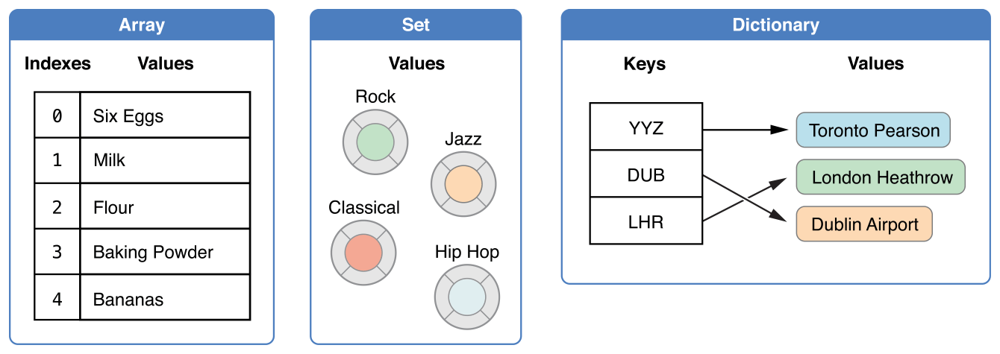

# Collection Types

最終更新日:

Swift は、配列(arrays)、セット(set)、辞書(dictionaries)と呼ばれる 3 つの基本的なコレクション型を提供しています。配列は順序が決まったコレクションです。セットは値の重複がない順序のないコレクションです。辞書はキーと値が紐づいた順序のないコレクションです。

Swift の配列、セット、辞書は常に保持できるキーや値の型が明確です。つまり、間違って違う型を挿入することができません。これはまた、コレクションから取得する値の型がはっきりとわかっていることでもあります。

> NOTE  
> Swift の配列、セット、辞書は、ジェネリックなコレクションとして実装されています。ジェネリック型やコレクションについての詳細は[Generics](./generics.md)を参照ください。

## Mutability of Collections

もし配列、セット、辞書を変数に代入した場合、生成されたコレクションを可変です。つまり、後々に追加、削除、要素の変更など、そのコレクションを取り替え(または変更)できます。もし配列、セット、辞書を定数に代入した場合、コレクションは不変で、そのサイズや内容は変更できません。

> NOTE  
> コレクションの変更が必要ない場合は、不変なコレクションを作成するのが良いプラクティスです。そうすることで、コードを理解しやすくし、Swiftのコンパイラもコレクションのパフォーマンスを最適化することができます。

## Arrays

### Array Type Shorthand Syntax

### Creating an Empty Array

### Creating an Array with a Default Value

### Creating an Array by Adding Two Arrays Together

### Creating an Array with an Array Literal

### Accessing and Modifying an Array

### Iterating Over an Array

## Sets

### Hash Values for Set Types

### Set Type Syntax

### Creating and Initializing an Empty Set

### Creating a Set with an Array Literal

### Accessing and Modifying a Set

### Iterating Over a Set

## Performing Set Operations

### Fundamental Set Operations

### Set Membership and Equality

## Dictionaries

### Dictionary Type Shorthand Syntax

### Creating an Empty Dictionary

### Creating a Dictionary with a Dictionary Literal

### Accessing and Modifying a Dictionary

### Iterating Over a Dictionary