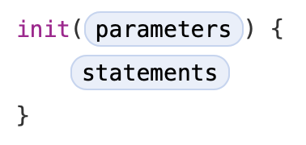

# Initialization(初期化)

最終更新日:

初期化(*Initialization*)は、使用するクラス、構造体、または列挙型のインスタンスを準備するプロセスです。このプロセスには、そのインスタンスに保存されている各プロパティの初期値の設定と、新しいインスタンスの使用準備が整う前に必要なその他の要素のセットアップや初期化の実行が含まれます。

この初期化プロセスを実装するには、イニシャライザ(*initializers*)を定義します。イニシャライザは、特定の型の新しいインスタンスを作成するために呼び出すことができる特別なメソッドのようなものです。Objective-C のイニシャライザとは異なり、Swift のイニシャライザは値を返しません。主な役割は、型の新しいインスタンスが初めて使用される前に正しく初期化されることを保証することです。

クラス型のインスタンスは、そのクラスのインスタンスが解放される直前にカスタムのクリーンアップを実行するデイニシャライザ(*deinitializer*) を実装することもできます。デイニシャライザの詳細については、[Deinitialization](./deinitialization.md)を参照ください。

## Setting Initial Values for Stored Properties(格納プロパティの初期値の設定)

クラスと構造は、そのクラスまたは構造体のインスタンスが作成されるまでに、格納されている全てのプロパティの適切な初期値を設定する必要があります。格納プロパティは、不確定な状態のままにすることはできません。

イニシャライザ内で、またはプロパティの定義の一部としてデフォルトのプロパティ値を割り当てることにより、格納プロパティの初期値を設定できます。これらのアクションについては、次のセクションで説明します。

> NOTE  
> 格納プロパティにデフォルト値を割り当てるか、イニシャライザ内でその初期値を設定すると、プロパティオブザーバを呼び出さずに、そのプロパティの値が直接設定されます。

### Initializers(イニシャライザ)

イニシャライザ(*initializers*)は、特定の型の新しいインスタンスを作成するために呼び出されます。最もシンプルな形式では、イニシャライザはパラメータのないインスタンスメソッドのようなもので、`init` キーワードを使用して記述されます:

```swift
init() {
    // ここで初期化を実行します
}
```

下記の例では、華氏で表された温度を保存するために `Fahrenheit` という新しい構造体を定義しています。`Fahrenheit` 構造体には、`Double` 型の `temperature` という 1 つの格納プロパティがあります。

```swift
struct Fahrenheit {
    var temperature: Double
    init() {
        temperature = 32.0
    }
}
var f = Fahrenheit()
print("The default temperature is \(f.temperature)° Fahrenheit")
// "The default temperature is 32.0° Fahrenheit"
```

この構造体は、パラメータのない単一のイニシャライザ `init` を定義します。これは、格納された温度を `32.0`(華氏での水の凝固点)の値で初期化します。

### Default Property Values(デフォルトのプロパティ値)

上記のように、イニシャライザ内から格納プロパティの初期値を設定できます。または、プロパティの宣言の一部としてデフォルトのプロパティ値(*default property value*)を指定します。これはプロパティの定義時に初期値を割り当てることにより、デフォルトのプロパティ値を指定します。

> NOTE  
> プロパティが常に同じ初期値を取る場合は、イニシャライザ内で値を設定するのではなく、デフォルト値を指定します。最終結果は同じですが、デフォルト値はプロパティの初期化を宣言とより密接に結び付けています。これにより、イニシャライザが短く明確になり、デフォルト値からプロパティの型を推論できるようになります。また、デフォルト値を使用すると、この章で後述するように、デフォルトのイニシャライザとイニシャライザの継承を利用しやすくなります。

プロパティが宣言された時点で `temperature` プロパティのデフォルト値を指定することにより、上記の `Fahrenheit` 構造体をよりシンプルな形式で書くことができます。

```swift
struct Fahrenheit {
    var temperature = 32.0
}
```

## Customizing Initialization(初期化のカスタマイズ)

次のセクションで説明するように、入力パラメータと optional プロパティ型を使用するか、初期化中に定数プロパティを割り当てることにより、初期化プロセスをカスタマイズできます。

### Initialization Parameters(イニシャライザの引数)

初期化パラメータをイニシャライザの定義の一部として提供して、初期化プロセスをカスタマイズする値の型と名前を定義できます。初期化パラメータには、関数およびメソッドパラメータと同じ機能と構文があります。

次の例では、摂氏で表された温度を格納する `Celsius` という構造体を定義しています。`Celsius` 構造体は、`init(fromFahrenheit:)` および `init(fromKelvin:)` という 2 つのカスタムイニシャライザを実装します。これらは、構造体の新しいインスタンスを異なる温度スケールの値で初期化しています。

```swift
struct Celsius {
    var temperatureInCelsius: Double
    init(fromFahrenheit fahrenheit: Double) {
        temperatureInCelsius = (fahrenheit - 32.0) / 1.8
    }
    init(fromKelvin kelvin: Double) {
        temperatureInCelsius = kelvin - 273.15
    }
}
let boilingPointOfWater = Celsius(fromFahrenheit: 212.0)
// boilingPointOfWater.temperatureInCelsius は 100.0
let freezingPointOfWater = Celsius(fromKelvin: 273.15)
// freezingPointOfWater.temperatureInCelsius は 0.0
```

最初のイニシャライザには、`fromFahrenheit` という引数ラベルと `fahrenheit` というパラメータ名を持つ単一の初期化パラメータがあります。2 番目のイニシャライザには、`fromKelvin` という引数ラベルと `kelvin` というパラメータ名を持つ単一の初期化パラメータがあります。どちらのイニシャライザも、単一の引数を対応する摂氏値に変換し、この値を `temperatureInCelsius` というプロパティに格納しています。

### Parameter Names and Argument Labels(パラメータ名と引数ラベル)

関数やメソッドのパラメータと同様に、初期化パラメータには、イニシャライザの本部内で使用するパラメータ名と、イニシャライザを呼び出すときに使用する引数ラベルの両方を含めることができます。

ただし、イニシャライザには、関数やメソッドのように括弧の前に識別関数名がありません。したがって、イニシャライザのパラメータの名前と型は、どのイニシャライザを呼び出す必要があるかを識別する上で特に重要な役割を果たします。このため、Swift は、イニシャライザが提供されていない場合、イニシャライザの全てのパラメータに自動で引数ラベルを提供します。

次の例では、`red`、`green`、`blue` という 3 つの定数プロパティを持つ `Color` という構造体を定義しています。これらのプロパティには、色の赤、緑、青の量を示す `0.0` ～ `1.0` の値が格納されます。

`Color` は、赤、緑、および青のコンポーネント用に `Double` 型の適切に名前が付けられた 3 つのパラメーターを含むイニシャライザを提供します。`Color` は、3 つ全ての色コンポーネントに同じ値を提供するために使用される、単一の `white` パラメーターを持つ 2 番目のイニシャライザも提供します。

```swift
struct Color {
    let red, green, blue: Double
    init(red: Double, green: Double, blue: Double) {
        self.red   = red
        self.green = green
        self.blue  = blue
    }
    init(white: Double) {
        red   = white
        green = white
        blue  = white
    }
}
```

両方のイニシャライザを使用して、各イニシャライザのパラメータに名前付きの値を指定することで、新しい `Color` インスタンスを作成できます。

```swift
let magenta = Color(red: 1.0, green: 0.0, blue: 1.0)
let halfGray = Color(white: 0.5)
```

引数ラベルを使用せずにこれらのイニシャライザを呼び出すことはできないことに注意してください。引数ラベルが定義されている場合は、常にイニシャライザで使用する必要があり、それらを省略するとコンパイルエラーになります。

```swift
let veryGreen = Color(0.0, 1.0, 0.0)
// 引数ラベルが必要になるため、コンパイルエラーになります
```

### Initializer Parameters Without Argument Labels(引数ラベルのないイニシャライザパラメータ)

初期化パラメータに引数ラベルを使用したくない場合は、そのパラメータの明示的な引数ラベルの代わりにアンダースコア (`_`) を記述して、デフォルトの挙動をオーバーライドします。

これは、上記の[Initialization Parameters](#initialization-parametersイニシャライザの引数)の `Celsius` の例の拡張バージョンで、すでに摂氏スケールにある `Double` 値から新しい `Celsius` インスタンスを作成する追加のイニシャライザを備えています。

```swift
struct Celsius {
    var temperatureInCelsius: Double
    init(fromFahrenheit fahrenheit: Double) {
        temperatureInCelsius = (fahrenheit - 32.0) / 1.8
    }
    init(fromKelvin kelvin: Double) {
        temperatureInCelsius = kelvin - 273.15
    }
    init(_ celsius: Double) {
        temperatureInCelsius = celsius
    }
}
let bodyTemperature = Celsius(37.0)
// bodyTemperature.temperatureInCelsius は 37.0
```

イニシャライザの呼び出し `Celsius(37.0)` は、意図が明確なので引数ラベルを必要としません。したがって、このイニシャライザを `init(_ celsius: Double)` と記述して、名前のない `Double` 値を指定して呼び出すことができるのは適切です。

### Optional Property Types(optional のプロパティ型)

カスタム型に、論理的に「値なし」が許される格納プロパティがある場合(おそらく、初期化中にその値を設定できないか、後で「値なし」が許可されるため)、プロパティを optional 型を使って宣言します。optional 型のプロパティは、値 `nil` で自動的に初期化されます。これは、プロパティが初期化中に意図的に「まだ値がない」ことを示しています。

次の例では、`SurveyQuestion` というクラスを定義し、optional の `String` プロパティとして `response` を指定します。

```swift
class SurveyQuestion {
    var text: String
    var response: String?
    init(text: String) {
        self.text = text
    }
    func ask() {
        print(text)
    }
}
let cheeseQuestion = SurveyQuestion(text: "Do you like cheese?")
cheeseQuestion.ask()
// "Do you like cheese?"
cheeseQuestion.response = "Yes, I do like cheese."
```

アンケートの質問への回答は質問されるまでわからないため、回答プロパティは `String?` または `Optional<String>` で宣言されています。`SurveyQuestion` の新しいインスタンスが初期化されると、デフォルト値の `nil`、つまり「文字列はまだありません」が自動的に割り当てられます。

### Assigning Constant Properties During Initialization(初期化中の定数プロパティの割り当て)

初期化が完了するまでに明確な値が設定されている限り、初期化中の任意の時点で定数プロパティに値を割り当てることができます。定数プロパティに値が割り当てられると、それ以上変更することはできません。

> NOTE  
> クラスインスタンスの場合、初期化中に定数プロパティを変更できるのは、それを導入したクラスだけです。サブクラスでは変更できません。

上記の `SurveyQuestion` の例を修正して、質問の `text` プロパティに変数プロパティではなく定数プロパティを使用して、`SurveyQuestion` のインスタンスが作成されたら質問が変更されないことを示すことができます。`text` プロパティは現在定数ですが、クラスのイニシャライザ内で設定できます。

```swift
class SurveyQuestion {
    let text: String
    var response: String?
    init(text: String) {
        self.text = text
    }
    func ask() {
        print(text)
    }
}
let beetsQuestion = SurveyQuestion(text: "How about beets?")
beetsQuestion.ask()
// "How about beets?"
beetsQuestion.response = "I also like beets. (But not with cheese.)"
```

## Default Initializers(デフォルトイニシャライザ)

Swift は、全てのプロパティにデフォルト値を提供し、少なくとも 1 つのイニシャライザを提供しない構造体またはクラスにデフォルトのイニシャライザを提供します。デフォルトのイニシャライザは、全てのプロパティがデフォルト値に設定された新しいインスタンスを作成するだけです。

この例では、ショッピングリスト内のアイテムの名前、数量、購入状態をカプセル化する `ShoppingListItem` というクラスを定義しています。

```swift
class ShoppingListItem {
    var name: String?
    var quantity = 1
    var purchased = false
}
var item = ShoppingListItem()
```

`ShoppingListItem` クラスの全てのプロパティにはデフォルト値があり、スーパークラスを持たない基本クラスのため、`ShoppingListItem` は、全てのプロパティにデフォルト値が設定された新しいインスタンスを作成するイニシャライザ実装を自動的に取得します。(`name` プロパティは optional の `String` プロパティのため、この値がコードに記述されていなくても、既定値の `nil` が自動的に取得されます)上記の例では、`ShoppingListItem` クラスの既定のイニシャライザを使用して `ShoppingListItem()` と記述し、新しいインスタンスを作成して `item` という変数に割り当てています。

### Memberwise Initializers for Structure Types(構造体のメンバごとのイニシャライザ)

構造体は、独自のカスタムイニシャライザを定義していない場合、メンバごとのイニシャライザを自動的に受け取ります。既定のイニシャライザとは異なり、構造体は、既定値を持たないプロパティが格納されている場合でも、メンバごとのイニシャライザを受け取ります。

メンバごとのイニシャライザは、新しい構造体インスタンスのメンバプロパティを初期化する簡単な方法です。新しいインスタンスのプロパティの初期値は、プロパティ名によってメンバごとのイニシャライザに渡すことができます。

下記の例では、`width` と `height` という 2 つのプロパティを持つ `Size` という構造体を定義しています。両方のプロパティは、デフォルト値 `0.0` を割り当てることにより、`Double` 型だと推論されます。

`Size` 構造体は、新しい `Size` インスタンスを初期化するために使用できるメンバごとのイニシャライザ `init(width:height:)` を自動的に受け取ります。

```swift
struct Size {
    var width = 0.0, height = 0.0
}
let twoByTwo = Size(width: 2.0, height: 2.0)
```

メンバごとのイニシャライザを呼び出すときは、既定値を持つ全てのプロパティの値を省略できます。上記の例では、`Size` 構造体の `height` と `width` の両方のプロパティにデフォルト値があります。プロパティのいずれかまたは両方を省略できます。イニシャライザは、省略した全てのプロパティに既定値を使用します。例えば、次のようになります。

```swift
let zeroByTwo = Size(height: 2.0)
print(zeroByTwo.width, zeroByTwo.height)
// "0.0 2.0"

let zeroByZero = Size()
print(zeroByZero.width, zeroByZero.height)
// "0.0 0.0"
```

## Initializer Delegation for Value Types(値型のイニシャライザの委譲)

イニシャライザは、他のイニシャライザを呼び出して、インスタンスの初期化の一部を実行できます。イニシャライザ委譲と呼ばれるこのプロセスは、複数のイニシャライザ間でコードが重複するのを防ぎます。

イニシャライザの委譲がどのように機能するか、および許可される委譲の形式に関する規則は、値型とクラス型で異なります。値型(構造体と列挙型)は継承をサポートしていないため、イニシャライザの委譲プロセスは比較的簡単です。ただし、継承で説明されているように、クラスは他のクラスから継承できます。これは、クラスが継承する全ての格納プロパティに、初期化中に適切な値が割り当てられることを保証する追加の責任があることを意味します。これらの責任は、下記の[Class Inheritance and Initialization](#class-inheritance-and-initializationクラスの継承と初期化)で説明されています。

値型の場合、独自のカスタムイニシャライザを作成するときに、`self.init` を使用して同じ値型から他のイニシャライザを参照します。`self.init` は、イニシャライザ内からのみ呼び出すことができます。

値型のカスタムイニシャライザを定義すると、その型の既定のイニシャライザ(または構造体の場合はメンバごとのイニシャライザ)にアクセスできなくなることに注意してください。この制約は、より複雑なイニシャライザで提供される追加の必須設定が、誰かが自動イニシャライザを使用することで誤ってイニシャライザが呼ばれない(=初期化が完全にできない)状況を防ぎます。

> NOTE  
> カスタムの値型を既定のイニシャライザとメンバごとのイニシャライザ、および独自のカスタムイニシャライザで初期化できるようにする場合は、値型の元の実装の一部としてではなく、extension にカスタムイニシャライザを記述します。詳細については、[Extension](./extensions.md)を参照ください。

次の例では、幾何学的な四角形を表すカスタム `Rect` 構造体を定義しています。この例では、`Size` と `Point` という 2 つのサポート構造が必要です。どちらも、全てのプロパティにデフォルト値 `0.0` を提供します:

```swift
struct Size {
    var width = 0.0, height = 0.0
}
struct Point {
    var x = 0.0, y = 0.0
}
```

下記の 3 つの方法のいずれかで、`Rect` 構造体を初期化できます。つまり、`0` で初期化されたデフォルトの `origin` と `size` のプロパティ値を使用するか、特定の原点とサイズを指定するか、特定の中心点とサイズを指定します。これらの初期化オプションは、`Rect` 構造体の定義の一部として 3 つのカスタムイニシャライザで表されます：

```swift
struct Rect {
    var origin = Point()
    var size = Size()
    init() {}
    init(origin: Point, size: Size) {
        self.origin = origin
        self.size = size
    }
    init(center: Point, size: Size) {
        let originX = center.x - (size.width / 2)
        let originY = center.y - (size.height / 2)
        self.init(origin: Point(x: originX, y: originY), size: size)
    }
}
```

最初の `Rect` イニシャライザ `init()` は、独自のカスタムイニシャライザがない場合に受け取るデフォルトのイニシャライザと機能的に同じです。このイニシャライザには、空の中括弧 `{}` のペアで表される空の本文があります。このイニシャライザを呼び出すと、原点とサイズのプロパティが両方ともプロパティ定義の `Point(x: 0.0, y: 0.0)` と `Size(width: 0.0, height: 0.0)` のデフォルト値で初期化された `Rect` インスタンスが返されます:

```swift
let basicRect = Rect()
// basicRect の origin は (0.0, 0.0) で size は (0.0, 0.0)
```

2 番目の `Rect` イニシャライザ `init(origin:size:)` は、独自のカスタムイニシャライザがない場合に構造体が受け取るメンバーごとのイニシャライザと機能的に同じです。このイニシャライザは、単に `origin` および `size` 引数の値を適切な格納されたプロパティに割り当てます:

```swift
let originRect = Rect(origin: Point(x: 2.0, y: 2.0),
                      size: Size(width: 5.0, height: 5.0))
// originRect の origin は (2.0, 2.0) で size は (5.0, 5.0)
```

3 番目の `Rect` イニシャライザ `init(center:size:)` は、もう少し複雑です。`center` と `size` 値に基づいて適切な原点を計算することから始めます。次に、`init(origin:size:)` イニシャライザを呼び出し(または委譲)します。このイニシャライザは、適切なプロパティに新しい原点とサイズの値を保存します。

```swift
let centerRect = Rect(center: Point(x: 4.0, y: 4.0),
                      size: Size(width: 3.0, height: 3.0))
// centerRect の origin は (2.5, 2.5) で size は (3.0, 3.0)
```

`init(center:size:)` イニシャライザを使っても、`origin` と `size` の新しい値を適切なプロパティに割り当てることができます。ただし、`init(center:size:)` イニシャライザは、適切な機能をすでに提供している既存のイニシャライザを利用する方が便利(そして意図がより明確)です。

> NOTE  
> `init()` および `init(origin:size:)` イニシャライザを、定義の外でこの例を記述する別の方法については、[Extension](./extensions.md)を参照ください。

## Class Inheritance and Initialization(クラスの継承と初期化)

クラスがスーパークラスから継承する全てのプロパティを含む、クラスの全ての格納プロパティには、初期化中に初期値を割り当てる必要があります。

Swift は、クラス型に対して 2 種類のイニシャライザを定義して、格納されている全てのプロパティが確実に初期値を受け取るようにします。これらは、指定イニシャライザ(*designated initializer*)および covenience イニシャライザ(*convenience initializer*)と呼ばれます。

### Designated Initializers and Convenience Initializers(指定イニシャライザとcovenience イニシャライザ)

指定イニシャライザ(*designated initializer*)は、クラスの主要なイニシャライザです。指定イニシャライザは、そのクラスによって導入された全てのプロパティを完全に初期化し、適切なスーパークラスイニシャライザを呼び出して、スーパークラスのチェーンまで初期化プロセスを続行します。

クラスには指定イニシャライザがほとんどない傾向があり、クラスが 1 つだけ持つことのが一般的です。指定イニシャライザは、初期化が行われる「漏斗」のような地点で、初期化プロセスはスーパークラスのチェーンへと上に向かって続行します。

全てのクラスには、少なくとも 1 つの指定イニシャライザが必要です。場合によっては、この要件は、以下の[Automatic Initializer Inheritance](#automatic-initializer-inheritance自動イニシャライザの継承)で説明されているように、スーパークラスから 1 つ以上の指定イニシャライザを継承することで満たされます。

convenience イニシャライザは二次的なもので、クラスのイニシャライザをサポートします。convenience イニシャライザを定義して、指定イニシャライザのパラメータの一部をデフォルト値に設定し、convenience イニシャライザから指定イニシャライザを呼び出すことができます。また、特定のユースケースまたは入力値型用にそのクラスのインスタンスを作成するために、convenience イニシャライザを定義することもできます。

クラスで必要ない場合は、convenience イニシャライザを提供する必要はありません。共通の初期化パターンへのショートカットとして時間の節約になったり、クラスの初期化の意図をより明確にできる場合は常に convenience イニシャライザを作成しましょう。

### Syntax for Designated and Convenience Initializers(指定イニシャライザとcovenience イニシャライザの構文)

クラスの指定イニシャライザは、値型のシンプルなイニシャライザと同じ方法で記述します:



covenience イニシャライザは同じスタイルで記述できますが、`init` キーワードの前にスペース区切りで `covenience` 修飾子を配置します:


### Initializer Delegation for Class Types(クラス型のイニシャライザの委譲)

### Two-Phase Initialization(2段階イニシャライザ)

### Initializer Inheritance and Overriding(イニシャライザの継承とオーバーライド)

### Automatic Initializer Inheritance(自動イニシャライザの継承)

### Designated and Convenience Initializers in Action(指定とcovenience イニシャライザの挙動)

## Failable Initializers(失敗可能イニシャライザ)

### Failable Initializers for Enumerations(列挙型の失敗可能イニシャライザ)

### Failable Initializers for Enumerations with Raw Values(Raw Valueを持つ列挙型の失敗可能イニシャライザ)

### Propagation of Initialization Failure(初期化の失敗の伝播)

### Overriding a Failable Initializer(失敗可能イニシャライザのオーバーライド)

### The init! Failable Initializer(init!を使った失敗可能イニシャライザ)

## Required Initializers(必須イニシャライザ)

## Setting a Default Property Value with a Closure or Function(クロージャまたは関数を使用したデフォルトのプロパティ値の設定)
