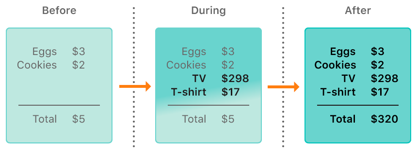

# Memory Safety

最終更新日:

デフォルトでは、Swift はコード内での安全でない動作の発生を防ぎます。例えば、Swift では、変数が使用される前に初期化され、メモリの割り当てが解除された後にメモリにアクセスされず、範囲外エラーがないか配列インデックスがチェックされます。

また、メモリ内の場所を変更するコードへの排他的アクセスを要求することで、メモリの同じ領域へ複数が競合してアクセスしないようにします。Swift はメモリを自動的に管理するため、ほとんどの場合、メモリへのアクセスについて考える必要はまったくありません。ただし、潜在的な競合が発生する可能性がある場所を理解することが重要です。そうすることで、メモリへのアクセスが競合するコードを記述しないようにすることができます。コードに競合が含まれている場合、コンパイル時または実行時エラーが発生します。

## Understanding Conflicting Access to Memory(メモリへのアクセスの競合を理解する)

変数の値を設定したり、関数に引数を渡したりするときに、コード内でメモリへのアクセスが発生します。例えば、次のコードには読み取りアクセスと書き込みアクセスの両方が含まれています:

```swift
// 1 が格納されているメモリへの書き込みアクセス
var one = 1

// 1 が格納されているメモリからの読み取りアクセス
print("We're number \(one)!")
```

コードの異なる部分がメモリ内の同じ場所に同時にアクセスしようとすると、メモリへのアクセスの競合が発生する可能性があります。メモリ内のある場所に同時に複数のアクセスを行うと、予測できない動作や一貫性のない動作が発生する可能性があります。Swift には、数行のコードにまたがる値を変更する方法があり、値自体の変更の途中で値へのアクセスを試みることができます。

紙に書かれた予算をどのように更新するかを考えて同様の問題を見てみます。予算は 2 段階のプロセスの更新されます。最初にアイテムの名前と価格を追加し、次に合計金額を変更して、現在リストにあるアイテムを反映します。更新の前後に、下の図に示すように、予算から任意の情報を読み取り、正しい答えを得ることができます。



予算にアイテムを追加している間は、新しく追加されたアイテムを反映するように合計金額が更新されていないため、一時的に無効な状態になります。アイテムを追加するプロセス中に合計金額を読むと、間違った情報が表示されます。

この例は、メモリへのアクセスの競合を修正するときに発生する可能性のある問題も示しています。競合を修正するには複数の方法があり、異なる回答が生成される場合があり、どちらの回答が正しいかは必ずしも明らかではありません。この例では、元の合計金額または更新された合計金額のどちらが必要かに応じて、5 ドルまたは 320 ドルが正しい答えになる可能性があります。競合するアクセスを修正する前に、それが何を意図していたかを判断する必要があります。

> NOTE  
> 同時実行またはマルチスレッドコードを作成したことがある場合、メモリへのアクセスの競合はよくある問題かもしれません。ただし、ここで説明するアクセスの競合はシングルスレッドで発生する可能性があり、同時実行またはマルチスレッド化されたコードは関係しません。
>
> シングルスレッド内からメモリへのアクセスが競合している場合、Swift はコンパイル時または実行時にエラーを確実に発生します。マルチスレッドコードの場合は、[Thread Sanitizer](https://developer.apple.com/documentation/xcode/diagnosing-memory-thread-and-crash-issues-early)を使用して、スレッド間で競合するアクセスを検出します。

### Characteristics of Memory Access(メモリアクセスの性質)

競合するアクセスの文脈上で考慮すべきメモリアクセスの 3 つの特性があります: アクセスが読み取りか書き込みか、アクセスの期間、およびアクセスされるメモリ内の場所です。具体的には、次の条件の全てを満たす 2 つのアクセスがある場合、競合が発生します。

* 少なくとも 1 つは、書き込みアクセスまたは非アトミックなアクセス
* メモリ内の同じ場所にアクセス
* メモリへのアクセス期間が重複

通常、読み取りと書き込みアクセスの違いは明らかです。書き込みアクセスはメモリ内の場所を変更しますが、読み取りアクセスは変更しません。メモリ内の場所は、アクセスされているもの(変数、定数、プロパティなど)を参照します。メモリアクセスの持続時間は、瞬時(*instantaneous*)または長期(*long-term*)です。

C 言語のアトミック操作を使用する場合のみ、操作はアトミックです。それ以外の場合は非アトミックです。これらの関数のリストについては、`stdatomic(3)` のマニュアルページを参照してください。

アクセスが開始されてから終了する前に他のコードを実行できない場合、アクセスは瞬時に行われます。その性質上、2 つの瞬間的なアクセスは同時に発生することはありません。ほとんどのメモリアクセスは瞬時に行われます。たとえば、下記のコードリストの全ての読み取りおよび書き込みアクセスは瞬時に行われます:

```swift
func oneMore(than number: Int) -> Int {
    return number + 1
}

var myNumber = 1
myNumber = oneMore(than: myNumber)
print(myNumber)
// "2"
```

ただし、長期アクセス(*long-term access*)と呼ばれる、他のコードの実行にまたがってメモリにアクセスする方法がいくつかあります。瞬時アクセスと長期アクセスの違いは、長期アクセスは開始から終了するまでの間に、他のコードが実行される可能性があることです。これをオーバーラップ(*overlap*)と呼びます。長期アクセスは、他の長期アクセスや瞬時アクセスと重複する可能性があります。

オーバーラップアクセスは、主に、関数とメソッド、または構造体の変更メソッドで `inout` 引数を使用するコードで発生します。長期アクセスを使用する特定の種類の Swift コードについては、次のセクションで説明します。

## Conflicting Access to In-Out Parameters(In-Out引数のアクセスの競合)

関数には、全ての in-out 引数への長期書き込みアクセスできます。in-out 引数への書き込みアクセスは、全ての in-out 以外の引数が評価された後に開始され、その関数呼び出しの全期間にわたって続きます。複数の in-out 引数がある場合、書き込みアクセスは引数が現れるのと同じ順序で開始されます。

この長期書き込みアクセスの問題の 1 つは、スコープルールとアクセス制御で許可されていても、in-out として渡された元の変数にアクセスできないことです。元の変数にアクセスすると、競合が発生します。例えば:

```swift
var stepSize = 1

func increment(_ number: inout Int) {
    number += stepSize
}

increment(&stepSize)
// エラー: stepSize へのアクセスが競合しています
```

上記のコードでは、`stepSize` はグローバル変数で、通常は `increment(_:)` 内からアクセスできます。ただし、`stepSize` への読み取りアクセスは、`number` への書き込みアクセスと重複します。次の図に示すように、`number` と `stepSize` は両方メモリ内の同じ場所を参照します。読み取りと書き込みアクセスは同じメモリを参照し、それらが重複して競合が発生します。


この競合を解決する 1 つの方法は、`stepSize` の明示的なコピーを作成することです。

```swift
// 明示的なコピーを作成します
var copyOfStepSize = stepSize
increment(&copyOfStepSize)

// オリジナルを更新します
stepSize = copyOfStepSize
// stepSize は 2 になりました
```

`increment(_:)` を呼び出す前に `stepSize` のコピーを作成すると、`copyOfStepSize` の値が現在の `stepSize` によって増分されることが明らかです。書き込みアクセスが開始される前に読み取りアクセスが終了するため、競合はありません。

in-out 引数への長期書き込みアクセスの別の問題として、同じ関数の複数の in-out 引数として単一の変数を渡すと、競合が発生します。例えば:

```swift
func balance(_ x: inout Int, _ y: inout Int) {
    let sum = x + y
    x = sum / 2
    y = sum - x
}
var playerOneScore = 42
var playerTwoScore = 30
balance(&playerOneScore, &playerTwoScore)  // OK
balance(&playerOneScore, &playerOneScore)
// エラー: playerOneScore へのアクセスが競合しています
```

上記の `balance(_:_:)` 関数は、その 2 つの引数を変更して、合計値をそれらの間で均等に分割します。`playerOneScore` と `playerTwoScore` を引数として呼び出しても競合は発生しません。時間的に重複する 2 つの書き込みアクセスがありますが、メモリ内の異なる場所にアクセスします。対照的に、両方の引数の値として `playerOneScore` を渡すと、メモリ内の同じ場所への 2 つの書き込みアクセスを同時に実行しようとするため、競合が発生します。

> NOTE  
> 演算子は関数であるため、in-out 引数に長期アクセスすることもできます。たとえば、`balance(_:_:)` が `<^>` という演算子である場合、`playerOneScore <^> playerOneScore` と記述すると、`balance(&playerOneScore, &playerOneScore)` と同じ競合が発生します。

## Conflicting Access to self in Methods(メソッド内のselfのアクセスの競合)

## Conflicting Access to Properties(プロパティのアクセスの競合)
