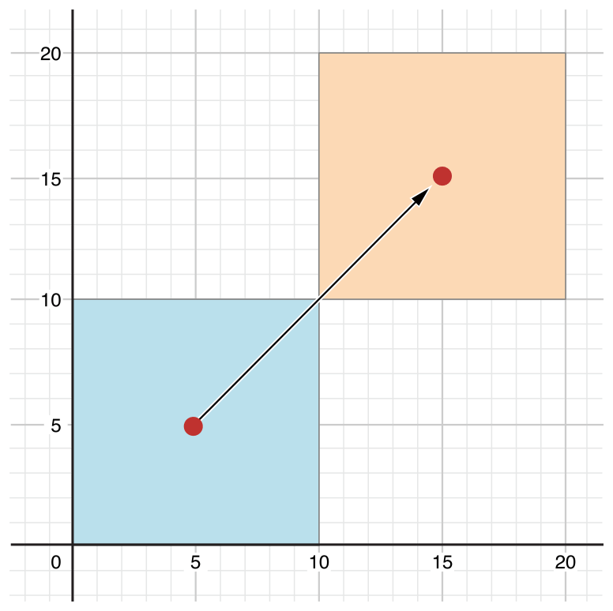

# Properties(プロパティ)

最終更新日:

プロパティは、値を特定のクラス、構造体、または列挙型に関連付けます。格納プロパティ(*stored property*)は定数と変数の値をインスタンスの一部として保存しますが、計算プロパティ(*computed property*)は値を(保存するのではなく)計算します。計算プロパティは、クラス、構造体、および列挙型から使用できます。格納プロパティは、クラスと構造体のみで使用できます。

格納および計算プロパティは、通常、特定の型のインスタンスに関連付けられています。ただし、プロパティを型自体に関連付けることもできます。このようなプロパティは、型プロパティ(*type property*)と呼ばれます。

さらに、プロパティオブザーバ(*property observer*)を定義して、プロパティ値の変更を監視して、それに応じたアクションを起こすことができます。プロパティオブザーバは、自分で定義した格納プロパティ、およびサブクラスがそのスーパークラスから継承するプロパティに追加できます。

プロパティラッパ(*property wrapper*)を使用して、複数のプロパティのゲッタとセッタでコードを再利用することもできます。

## Stored Properties(格納プロパティ)

最もシンプルな形式だと、格納プロパティ(*Stored Property*)は、特定のクラスまたは構造体のインスタンスの一部として保存される定数または変数です。格納プロパティは、変数格納プロパティ(`var`)または定数格納プロパティ(`let`) のいずれかです。

[Default Property Values](./initialization.md#default-property-valuesデフォルトプロパティ値)で説明されているように、格納プロパティのデフォルト値をその定義の一部として設定できます。また、初期化中に格納プロパティの初期値を設定および変更することもできます。これは、[Assigning Constant Properties During Initialization](./initialization.md#assigning-constant-properties-during-initialization初期化中の定数プロパティへの値の設定)で説明されているように、定数の格納にも当てはまります。

以下の例では、`FixedLengthRange` という構造体を定義しています。これは、作成後に範囲の長さを変更できない整数の範囲を記述します。

```swift
struct FixedLengthRange {
    var firstValue: Int
    let length: Int
}
var rangeOfThreeItems = FixedLengthRange(firstValue: 0, length: 3)
// 0, 1, 2 の整数の範囲を表しています
rangeOfThreeItems.firstValue = 6
// 6, 7, 8 の整数の範囲を表しています
```

`FixedLengthRange` のインスタンスには、`firstValue` と呼ばれる変数格納プロパティと `length` という定数格納プロパティがあります。上記の例では、定数のため、長さは新しい範囲が作成されたときに初期化され、それ以降は変更できません。

### Stored Properties of Constant Structure Instances(定数に保存されたインスタンスのプロパティ)

構造体のインスタンスを作成し、そのインスタンスを定数に割り当てる場合、インスタンスのプロパティは、変数で宣言されていても変更できません。

```swift
let rangeOfFourItems = FixedLengthRange(firstValue: 0, length: 4)
// 0, 1, 2 の整数の範囲を表しています
rangeOfFourItems.firstValue = 6
// firstValue は変数ですがエラーになります
```

`rangeOfFourItems` は定数として(`let` キーワードを使用して)宣言されているため、`firstValue` が変数でも、その `firstValue` プロパティを変更することはできません。

この挙動は、構造型が値型のためです。値型のインスタンスが定数としてマークされている場合、その全てのプロパティも同様です。

参照型のクラスには同じことが当てはまりません。参照型のインスタンスを定数に割り当てた場合でも、そのインスタンスの変数を変更できます。

### Lazy Stored Properties(遅延格納プロパティ)

遅延格納プロパティ(*lazy stored property*)は、最初に使用されるまで初期値が計算されないプロパティです。宣言の前に `lazy` 修飾子を記述して、遅延格納プロパティを示します。

> NOTE  
> インスタンスの初期化が完了するまで初期値が取得できない可能性があるため、遅延プロパティは常に変数として(`var` キーワードを使用して)宣言する必要があります。定数プロパティは、初期化が完了する前に常に値を持っている必要があるため、`lazy` で宣言することはできません。

遅延格納プロパティは、プロパティの初期値が、インスタンスの初期化が完了後でないと値がわからない外部要因に依存している場合に役立ちます。プロパティの初期値が必要になるまで実行すべきではない、複雑または計算コストの高いセットアップが必要な場合にも役立ちます。

下記の例では、遅延格納プロパティを使用して、複雑なクラスの不必要な初期化を回避しています。この例では、`DataImporter` と `DataManager` という 2 つのクラスを定義していますが、どちらも全体像は見せていません:

```swift
class DataImporter {
    /*
    DataImporter は、外部ファイルからデータをインポートするためのクラスです
    このクラスは、初期化にかなりの時間がかかると想定します
    */
    var filename = "data.txt"
    // DataImporter クラスは、ここでデータのインポート機能を提供します
}

class DataManager {
    lazy var importer = DataImporter()
    var data = [String]()
    // DataManager クラスはここでデータの管理機能を提供します
}

let manager = DataManager()
manager.data.append("Some data")
manager.data.append("Some more data")
// importer プロパティの DataImporter インスタンスはまだ作成されていません
```

`DataManager` クラスには、`data` と呼ばれる格納プロパティがあり、新しい空の `String` 型の配列で初期化されています。残りの機能は示されていませんが、この `DataManager` クラスの目的は、この `String` の配列を管理し、アクセスする機能を提供することです。

`DataManager` クラスの機能の一部は、ファイルからデータをインポートする機能です。この機能は、`DataImporter` クラスによって提供されています。このクラスは、初期化にかなりの時間がかかると想定されています。これは、`DataImporter` インスタンスが初期化されるときに、`DataImporter` インスタンスがファイルを開いてその内容をメモリに読み込む必要があるからかもしれません。

`DataManager` インスタンスはファイルからデータをインポートしなくてもデータを管理できるため、`DataManager` 自体が作成されるときに、`DataManager` は新しい `DataImporter` インスタンスを作成しません。代わりに、`DataImporter` インスタンスを最初に使用するときに作成する方が理にかなっています。

`lazy` 修飾子でマークされているため、`importer` プロパティの `DataImporter` インスタンスは、`importer` プロパティが最初にアクセスされたとき(`filename` プロパティが照会されたときなど)にのみ作成されます。

```swift
print(manager.importer.filename)
// importer プロパティの DataImporter インスタンスが作成されました
// "data.txt"
```

> NOTE  
> `lazy` 修飾子でマークされたプロパティが複数のスレッドから同時にアクセスされ、そのプロパティがまだ初期化されていない場合、そのプロパティが 1 回だけ初期化されるという保証はありません。

### Stored Properties and Instance Variables(格納プロパティはインスタンス変数)

`Objective-C` の経験がある場合は、クラスインスタンスの一部として値と参照を格納する 2 つの方法が提供されていることを知っているかもしれません。プロパティに加えて、インスタンス変数をプロパティに格納されている値のバッキングストアとして使用できます。

Swift は、これらの概念を単一のプロパティ宣言に統合しました。Swift のプロパティには対応するインスタンス変数がなく、プロパティのバッキングストアには直接アクセスしません。このアプローチにより、様々なコンテキストで値にアクセスできてしまうことから起きる混乱が回避され、ただ唯一のプロパティの宣言へと単純化されています。名前、型、メモリ管理特性など、プロパティに関する全ての情報は、型の定義の一部として 1 つの場所に集約されます。

## Computed Properties(計算プロパティ)

格納プロパティに加えて、クラス、構造体、および列挙型は、値を保存しない計算プロパティを定義できます。代わりに、間接的に他のプロパティの値の取得するゲッタと、必要ならば、値の設定を行うセッタを提供します。

```swift
struct Point {
    var x = 0.0, y = 0.0
}
struct Size {
    var width = 0.0, height = 0.0
}
struct Rect {
    var origin = Point()
    var size = Size()
    var center: Point {
        get {
            let centerX = origin.x + (size.width / 2)
            let centerY = origin.y + (size.height / 2)
            return Point(x: centerX, y: centerY)
        }
        set(newCenter) {
            origin.x = newCenter.x - (size.width / 2)
            origin.y = newCenter.y - (size.height / 2)
        }
    }
}
var square = Rect(origin: Point(x: 0.0, y: 0.0),
                  size: Size(width: 10.0, height: 10.0))
let initialSquareCenter = square.center
square.center = Point(x: 15.0, y: 15.0)
print("square.origin is now at (\(square.origin.x), \(square.origin.y))")
// "square.origin is now at (10.0, 10.0)"
```

この例では、幾何学的形状を操作するための 3 つの構造体を定義しています。

* `Point` は、x 座標と y 座標をカプセル化しています
* `Size` は `width` と `height` をカプセル化しています
* `Rect` は、原点とサイズで四角形を定義しています

`Rect` 構造体は、`center` と呼ばれる計算プロパティも提供します。`Rect` の現在の中心位置は常にその `origin` と `size` から判断できるため、中心点を明示的に `Point` として保存する必要はありません。代わりに、`Rect` は `center` と呼ばれる計算プロパティ変数のカスタム ゲッタとセッタを定義して、あたかも格納プロパティかのように四角形の中心を操作できるようにします。

上記の例では、`square` という新しい `Rect` 変数を作成しています。`square` 変数は、原点 `(0, 0)`、幅と高さ `10` で初期化されます。この正方形は、下の図では青い正方形で表されています。

次に、ドット構文(`square.center`)を介して `Square` 変数の `center` プロパティにアクセスします。これにより、`center` のゲッタが呼び出され、現在のプロパティ値が取得できます。ゲッタは、既存の値を返すのではなく、正方形の中心を表す新しい `Point` を計算して返します。上記のように、ゲッタは `(5, 5)` の中心点を正しく返します。

次に、`center` プロパティに新しく `(15, 15)` が設定されます。これにより、下の図のオレンジ色の正方形で示されている新しい位置に正方形が上下に移動します。`center` プロパティを設定すると、保存されている `origin` プロパティの `x` と `y` の値を変更する `center` のセッタが呼び出され、正方形が新しい位置に移動します。



### Shorthand Setter Declaration(短縮セッタ宣言)

計算プロパティのセッタが、設定される新しい値の名前を定義しない場合、デフォルト名の `newValue` が使用されます。この省略表記を利用した `Rect` 構造体の代替バージョンを次に示します:

```swift
struct AlternativeRect {
    var origin = Point()
    var size = Size()
    var center: Point {
        get {
            let centerX = origin.x + (size.width / 2)
            let centerY = origin.y + (size.height / 2)
            return Point(x: centerX, y: centerY)
        }
        set {
            origin.x = newValue.x - (size.width / 2)
            origin.y = newValue.y - (size.height / 2)
        }
    }
}
```

### Shorthand Getter Declaration(短縮ゲッタ宣言)

ゲッタの本文全体が単一の式の場合、ゲッタは暗黙的にその式を返します。この省略表記とセッタの省略表記を利用した別のバージョンの `Rect` 構造体を次に示します:

```swift
struct CompactRect {
    var origin = Point()
    var size = Size()
    var center: Point {
        get {
            Point(x: origin.x + (size.width / 2),
                  y: origin.y + (size.height / 2))
        }
        set {
            origin.x = newValue.x - (size.width / 2)
            origin.y = newValue.y - (size.height / 2)
        }
    }
}
```

ゲッタからの戻り値の省略は、[Functions With an Implicit Return](./functions.md#functions-with-an-implicit-return暗黙的な戻り値がある関数)で説明されているように、関数からの戻り値を省略した場合と同じ規則に従います。

### Read-Only Computed Properties(読み取り専用計算プロパティ)

ゲッタはあるがセッタは持たない計算プロパティは、読み取り専用の計算プロパティ(*read-only computed property*)と呼ばれます。読み取り専用計算プロパティは常に値を返し、ドット構文を介してアクセスできますが、別の値を設定することはできません。

> NOTE  
> 計算プロパティ(読み取り専用を含む)は、その値が固定されていないため、`var` キーワードを使用して変数プロパティとして宣言する必要があります。`let` キーワードは定数プロパティにのみ使用され、インスタンスの初期化の一部として設定された後は値を変更できないことを示します。

`get` キーワードとその中括弧(`{}`)を削除することで、読み取り専用計算プロパティの宣言を簡素化できます。

```swift
struct Cuboid {
    var width = 0.0, height = 0.0, depth = 0.0
    var volume: Double {
        return width * height * depth
    }
}
let fourByFiveByTwo = Cuboid(width: 4.0, height: 5.0, depth: 2.0)
print("the volume of fourByFiveByTwo is \(fourByFiveByTwo.volume)")
// "the volume of fourByFiveByTwo is 40.0"
```

この例では、`Cuboid` という新しい構造体を定義します。これは、`width`、`height`、`depth` プロパティを持つ 3D の長方形のボックスを表します。この構造体には、`volume` と呼ばれる読み取り専用の計算プロパティもあります。これは、直方体の現在のボリュームを計算して返します。特定のボリューム値に `width`、`height`、`depth` のどの値を使用するかについてあいまいになるため、`volume` を設定可能にすることは意味がありません。それでも、`Cuboid` が読み取り専用の計算プロパティを提供して、外部ユーザーが現在の計算済みボリュームを見られようにすると便利です。

## Property Observers

## Property Wrappers(プロパティラッパ)

### Setting Initial Values for Wrapped Properties(ラップされたプロパティの初期値の設定)

### Projecting a Value From a Property Wrapper(Property Wrapperからの値の投影)

## Global and Local Variables(グローバル変数とローカル変数)

## Type Properties

### Type Property Syntax

### Querying and Setting Type Properties