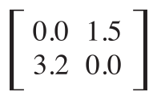

# Subscripts \(サブスクリプト\)

最終更新日: 2021/5/29

クラス、構造体、および列挙型は、コレクション、リスト、またはシーケンスのメンバ要素にアクセスするためのショートカットとして subscript を定義できます。subscript を使用すると、インデックスを使って値を設定および取得でき、設定と取得に個別のメソッドを必要としません。例えば、`Array` インスタンスの要素には `someArray[index]` としてアクセスし、`Dictionary` インスタンスの要素には `someDictionary[Key]` としてアクセスします。

単一の型に対して複数の subscript を定義でき、使用する適切な subscript のオーバーロードは、subscript に渡すインデックス値の型に基づいて選択されます。subscript は 1 つの次元に限定されず、カスタムの型のニーズに合わせて複数の入力引数で subscript を定義することもできます。

## Subscript Syntax\(subscript構文\)

subscript を使用すると、インスタンス名の後に 1 つ以上の値を角括弧\(`[]`\)で囲むことで、型のインスタンスをクエリできます。それらの構文は、インスタンスメソッドの構文と計算プロパティの構文の両方に似ています。インスタンスメソッドと同じ方法で、`subscript` キーワードを使用して subscript 定義を記述し、1 つ以上の入力引数と戻り値の型を指定します。インスタンスメソッドとは異なり、subscript は読み取り/書き込みまたは読み取り専用にすることができます。この挙動は、計算プロパティの場合と同じ方法で get/set プロパティとやり取りをします。

```swift
subscript(index: Int) -> Int {
    get {
        // ここで適切な値を返します
    }
    set(newValue) {
        // ここで適切な値を設定するアクションをします
    }
}
```

`newValue` の型は、subscript の戻り値と同じです。計算プロパティと同様に、set プロパティの `(newValue)` 引数を指定しないこともできます。自分で設定しない場合、`newValue` というデフォルトの引数が set プロパティに提供されます。

読み取り専用の計算プロパティと同様に、`get` キーワードとその中括弧\(`{}`\)を削除することで、読み取り専用の subscript の宣言を簡単にできます:

```swift
subscript(index: Int) -> Int {
    // ここで適切な値を返します
}
```

これは、整数の n 倍数のテーブルを表す `TimesTable` 構造体を定義する読み取り専用の subscript の実装の例です。

```swift
struct TimesTable {
    let multiplier: Int
    subscript(index: Int) -> Int {
        return multiplier * index
    }
}
let threeTimesTable = TimesTable(multiplier: 3)
print("six times three is \(threeTimesTable[6])")
// "six times three is 18"
```

この例では、`TimesTable` の新しいインスタンスが作成され、3 の倍数テーブルを表します。上記では、インスタンスの `multiplier` 引数に使用する値として、構造体のイニシャライザに値 `3` を渡しています。

`threeTimesTable[6]` への呼び出しでも示されているように、subscript を呼び出すことで `threeTimesTable` インスタンスにクエリを実行できます。これは、3 の倍数テーブルの `6` 番目のエントリを要求し、値 `18`、つまり 3 x 6 を返します。

> NOTE  
> n 倍数テーブル は、決まった数学ルールに基づいています。`threeTimesTable[someIndex]` を新しい値に設定することは適切ではないため、`TimesTable` のsubscript は読み取り専用の subscript として定義されています。

## Subscript Usage\(subscriptの利用\)

subscript の正確な意味合いは、使用されるコンテキストによって異なります。subscript は通常、コレクション、リスト、またはシーケンス内のメンバ要素にアクセスするためのショートカットとして使用されます。特定のクラスまたは構造体の機能に最も適した方法で、自由に subscript を実装できます。

例えば、Swift の `Dictionary` 型は、`Dictionary` インスタンスに格納されているバリューを設定および取得するための subscript を実装します。辞書にバリューを設定するには、辞書のキーの型を subscript の角括弧\(`[]`\)で囲み、辞書のバリューの型の値を subscript に割り当てます:

```swift
var numberOfLegs = ["spider": 8, "ant": 6, "cat": 4]
numberOfLegs["bird"] = 2
```

上記の例では、`numberOfLegs` という変数を定義し、3 つのキーとバリューのペアを含む辞書リテラルで初期化します。`numberOfLegs` 辞書の型は `[String: Int]` だと推論されます。この例では、辞書を作成した後、subscript の割り当てを使用して、`"bird"` という `String` キーと 2 という `Int` のバリューを辞書に追加します。

`Dictionary` の subscript の詳細については、[Accessing and Modifying a Dictionary](collection-types.md#accessing-and-modifying-a-dictionary辞書へのアクセスと変更)を参照ください。

> NOTE  
> Swift の `Dictionary` 型は、オプショナルの型を受け取って返す subscript としてキーの subscript を実装します。上記の `numberOfLegs` 辞書の場合、キーとバリューの subscript は `Int?` または オプショナルInt 型の値を受け取って返します。`Dictionary` 型は、 オプショナルの subscript の型を使用して、全てのキーにバリューがあるわけではないということをモデル化し、そのキーに `nil` 値を割り当てることによってキーのバリューを削除する方法を提供します。

## Subscript Options\(様々なsubscript\)

subscript は、任意の数の入力引数を受け取ることができ、これらの入力引数は任意の型にすることができます。subscript は、任意の型の値を返すこともできます。

関数と同様に、subscript は様々な数の引数を受け取り、引数のデフォルト値を提供できます。これについては、[Variadic Parameters](functions.md#variadic-parameters可変長引数)と[Default Parameter Values](functions.md#default-parameter-valuesデフォルト引数値)で説明しています。ただし、関数とは異なり、subscript は `inout` 引数を使用できません。

クラスまたは構造体は、必要なだけ subscript の実装を提供でき、使用される適切な subscript は、subscript が使用される時点で subscript のブラケット\(`[]`\)内に含まれる値の型に基づいて推論されます。この複数の subscript の定義は、subscript のオーバーロードとして知られています。

subscript は単一の引数を取るのが最も一般的ですが、型に適している場合は、複数の引数を持つ subscript を定義することもできます。次の例では、`Double` 値の 2 次元マトリックスを表す `Matrix` 構造体を定義しています。`Matrix` 構造体の subscript は、2 つの整数引数を取ります:

```swift
struct Matrix {
    let rows: Int, columns: Int
    var grid: [Double]
    init(rows: Int, columns: Int) {
        self.rows = rows
        self.columns = columns
        grid = Array(repeating: 0.0, count: rows * columns)
    }
    func indexIsValid(row: Int, column: Int) -> Bool {
        return row >= 0 && row < rows && column >= 0 && column < columns
    }
    subscript(row: Int, column: Int) -> Double {
        get {
            assert(indexIsValid(row: row, column: column), "Index out of range")
            return grid[(row * columns) + column]
        }
        set {
            assert(indexIsValid(row: row, column: column), "Index out of range")
            grid[(row * columns) + column] = newValue
        }
    }
}
```

`Matrix` は、`rows` と `columns` と呼ばれる 2 つの引数を受け取るイニシャライザを提供し、`Double` 型の `rows` \* `columns` の値を格納するのに十分な大きさの配列を作成します。マトリックス内の各位置には、`0.0` の初期値が与えられます。これを実現するために、配列のサイズと初期セル値 `0.0` が、正しいサイズの新しい配列を作成して初期化するイニシャライザに渡されます。このイニシャライザについては、[Creating an Array with a Default Value](collection-types.md#creating-an-array-with-a-default-valueデフォルト値を使った配列の作成)で詳しく説明しています。

適切な `rows` 数と `columns` 数をイニシャライザに渡すことで、新しい `Matrix` インスタンスを構築できます:

```swift
var matrix = Matrix(rows: 2, columns: 2)
```

上記の例では、2 行 2 列の新しい `Matrix` インスタンスを作成します。この `Matrix` インスタンスの `grid` 配列は、左上から右下に読み取られるように、事実上、フラット化されたバージョンのマトリックスです:


行列の値は、行と列の値をカンマで区切って subscript に渡すことで設定できます。

```swift
matrix[0, 1] = 1.5
matrix[1, 0] = 3.2
```

これらの 2 つの文は、subscript の set プロパティを呼び出して、行列の右上の位置\(`row` は 0、`column` は 1\) に 1.5 の値を設定し、左下の位置 \(`row` は `1`、`column` は `0`\) に `3.2` の値を設定します。



`Matrix` subscript の get/set プロパティには、subscript の `row` と `column` の値が有効なことを確認するためのアサーションが含まれています。これらのアサーションを支援するために、`Matrix` には `indexIsValid(row:column:)` という便利なメソッドが含まれています。これは、要求された `row` と `column` が行列の境界内にあるかどうかをチェックします:

```swift
func indexIsValid(row: Int, column: Int) -> Bool {
    return row >= 0 && row < rows && column >= 0 && column < columns
}
```

行列の境界の外にある subscript にアクセスしようとすると、実行時エラーが発生します。

```swift
let someValue = matrix[2, 2]
// [2, 2] は、行列の境界の外にあるので実行時エラーが発生します
```

## Type Subscripts\(型subscript\)

上で説明したように、インスタンスの subscript は、特定の型のインスタンスで呼び出す subscript です。加えて、型自体で呼び出される subscript を定義することもできます。この種の subscript は、型 subscript\(_type subscript_\)と呼ばれます。`subscript` キーワードの前に `static` キーワードを記述して、型 subscript を示します。クラスは代わりに `class` キーワードを使用すると、サブクラスがその subscript のスーパークラスの実装をオーバーライドすることができます。下記の例は、型 subscript を定義して呼び出す方法を示しています。

```swift
enum Planet: Int {
    case mercury = 1, venus, earth, mars, jupiter, saturn, uranus, neptune
    static subscript(n: Int) -> Planet {
        return Planet(rawValue: n)!
    }
}
let mars = Planet[4]
print(mars)
```

