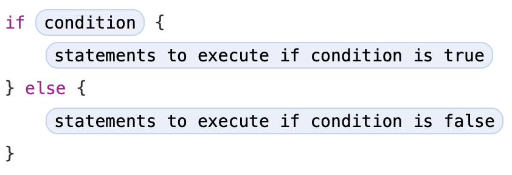

# Statements \(文\)

最終更新日:

Swift では、単純な文、コンパイラ制御文、および制御フロー文の 3 種類の文があります。単純な文は最も一般的で、式または宣言で構成されています。コンパイラ制御文により、プログラムはコンパイラの動作の側面を変更し、条件付きコンパイルブロックと行制御文を含めます。

制御フロー文は、プログラム内の実行の流れを制御するために使用されます。ループ文、分岐文、および制御転送文を含む、Swift にはいくつかの種類の制御フロー文があります。ループ文はコードブロックを繰り返し実行できるようにし、分岐文は特定の条件が満たされたときにのみ特定のコードブロックを実行できるようにし、制御転送文はコードが実行される順序を変更する方法を提供します。さらに、Swift は、スコープを導入し、エラーをキャッチして処理するための `do` 文、および現在のスコープが終了する直前のクリーンアップアクションを実行するための `defer` 文を提供します。

セミコロン(`;`)は任意の文の後に書くことができ、同じ行に複数の文が書かれている場合に、それらを分離するために使用されます。

> GRAMMAR OF A STATEMENT  
> statement → [expression](https://docs.swift.org/swift-book/ReferenceManual/Expressions.html#grammar_expression)  `;`<sub>*opt*</sub>  
> statement → [declaration](https://docs.swift.org/swift-book/ReferenceManual/Declarations.html#grammar_declaration)  `;`<sub>*opt*</sub>  
> statement → [loop-statement](https://docs.swift.org/swift-book/ReferenceManual/Statements.html#grammar_loop-statement)  `;`<sub>*opt*</sub>  
> statement → [branch-statement](https://docs.swift.org/swift-book/ReferenceManual/Statements.html#grammar_branch-statement)  `;`<sub>*opt*</sub>  
> statement → [labeled-statement](https://docs.swift.org/swift-book/ReferenceManual/Statements.html#grammar_labeled-statement)  `;`<sub>*opt*</sub>  
> statement → [control-transfer-statement](https://docs.swift.org/swift-book/ReferenceManual/Statements.html#grammar_control-transfer-statement)  `;`<sub>*opt*</sub>  
> statement → [defer-statement](https://docs.swift.org/swift-book/ReferenceManual/Statements.html#grammar_defer-statement)  `;`<sub>*opt*</sub>  
> statement → [do-statement](https://docs.swift.org/swift-book/ReferenceManual/Statements.html#grammar_do-statement)  `;`<sub>*opt*</sub>  
> statement → [compiler-control-statement](https://docs.swift.org/swift-book/ReferenceManual/Statements.html#grammar_compiler-control-statement)  
> statements → [statement](https://docs.swift.org/swift-book/ReferenceManual/Statements.html#grammar_statement)  [statements](https://docs.swift.org/swift-book/ReferenceManual/Statements.html#grammar_statements)<sub>*opt*</sub>

## Loop Statements(ループ文)

ループ文では、ループで指定された条件に応じて、コードブロックを繰り返し実行できます。Swift には 3 つのループ文があります。`for-in` 文、`while` 文、および `repeat-while` 文です。

ループ文内の制御フローは、`break` 文と `continue` 文によって変更でき、下記の [Break Statement](#break-statementbreak文) 文と条件文[Continue Statement](#continue-statementcontinue文)で説明します。

> GRAMMAR OF A LOOP STATEMENT  
> loop-statement → [for-in-statement](https://docs.swift.org/swift-book/ReferenceManual/Statements.html#grammar_for-in-statement)  
> loop-statement → [while-statement](https://docs.swift.org/swift-book/ReferenceManual/Statements.html#grammar_while-statement)  
> loop-statement → [repeat-while-statement](https://docs.swift.org/swift-book/ReferenceManual/Statements.html#grammar_repeat-while-statement)

### For-In Statement(For-In文)

`for-in` 文は、[Sequence](https://developer.apple.com/documentation/swift/sequence)に準拠したコレクション(または任意の型)内の各項目に対して 1 回のコードブロックを実行できます。

`for-in` 文の形式は次のとおりです:


`makeIterator()` メソッドは、[IteratorProtocol](https://developer.apple.com/documentation/swift/iteratorprotocol)プロトコルに準拠した型のイテレータ型の値を取得するために、collection 式で呼び出されます。プログラムは、イテレータ上で `next()` メソッドを呼び出すことによってループの実行を開始します。返された値が `nil` ではない場合、item に代入され、プログラムは statements を実行し、再びループの先頭から実行を続行します。それ以外の場合、プログラムは値の代入や、statements を実行せず、 `for-in` 文の実行は終了しています。

> GRAMMAR OF A FOR-IN STATEMENT  
> for-in-statement → `for` `case`<sub>*opt*</sub> [pattern](https://docs.swift.org/swift-book/ReferenceManual/Patterns.html#grammar_pattern)  `in` [expression](https://docs.swift.org/swift-book/ReferenceManual/Expressions.html#grammar_expression)  [where-clause](https://docs.swift.org/swift-book/ReferenceManual/Statements.html#grammar_where-clause)<sub>*opt*</sub> [code-block](https://docs.swift.org/swift-book/ReferenceManual/Declarations.html#grammar_code-block)

### While Statement(While文)

`while` 文は、条件が true な限り、コードブロックを繰り返し実行できます。

`while` 文の形式は次のとおりです:


`while` 文は次のように実行されます。

1. condition が評価されます
`true` の場合、実行はステップ 2 に続きます。`false` の場合、プログラムは while 文の実行を終了します

2. プログラムは statements を実行し、実行はステップ 1 に戻ります

condition の値は、statements が実行される前に評価されるため、`while` 文内の statements は 0 回以上実行されます。

condition の値は、`Bool` 型または `Bool` にブリッジされた型でなければなりません。[Optional Binding](./../language-guide/the-basics.md#optional-bindingオプショナルバインディング)で説明したように、条件はオプショナルバインディング宣言にすることもできます。

> GRAMMAR OF A WHILE STATEMENT  
> while-statement → `while` [condition-list](https://docs.swift.org/swift-book/ReferenceManual/Statements.html#grammar_condition-list)  [code-block](https://docs.swift.org/swift-book/ReferenceManual/Declarations.html#grammar_code-block)  
> condition-list → [condition](https://docs.swift.org/swift-book/ReferenceManual/Statements.html#grammar_condition) \|  [condition](https://docs.swift.org/swift-book/ReferenceManual/Statements.html#grammar_condition)  `,` [condition-list](https://docs.swift.org/swift-book/ReferenceManual/Statements.html#grammar_condition-list)  
> condition → [expression](https://docs.swift.org/swift-book/ReferenceManual/Expressions.html#grammar_expression) \|  [availability-condition](https://docs.swift.org/swift-book/ReferenceManual/Statements.html#grammar_availability-condition) \|  [case-condition](https://docs.swift.org/swift-book/ReferenceManual/Statements.html#grammar_case-condition) \|  [optional-binding-condition](https://docs.swift.org/swift-book/ReferenceManual/Statements.html#grammar_optional-binding-condition)  
> case-condition → `case` [pattern](https://docs.swift.org/swift-book/ReferenceManual/Patterns.html#grammar_pattern)  [initializer](https://docs.swift.org/swift-book/ReferenceManual/Declarations.html#grammar_initializer)  
> optional-binding-condition → `let` [pattern](https://docs.swift.org/swift-book/ReferenceManual/Patterns.html#grammar_pattern)  [initializer](https://docs.swift.org/swift-book/ReferenceManual/Declarations.html#grammar_initializer) \|  `var` [pattern](https://docs.swift.org/swift-book/ReferenceManual/Patterns.html#grammar_pattern)  [initializer](https://docs.swift.org/swift-book/ReferenceManual/Declarations.html#grammar_initializer)

### Repeat-While Statement(Repeat-While文)

`repeat-while` 文は、条件が true な限り、コードブロックを 1 回以上実行できます。

`repeat-while` 文の形式は次のとおりです:


`repeat-while` 文は次のように実行されます。

1. プログラムは statements を実行し、実行はステップ 2 に進みます

2. condition が評価されます
`true` の場合、実行はステップ 1 に戻ります。`false` の場合、プログラムは `repeat-while` 文の実行を終了します

condition の値は statements の実行後に評価されるため、`repeat-while` 文の文は少なくとも 1 回実行されます。

condition の値は、`Bool` 型または `Bool` にブリッジされた型の必要があります。[Optional Binding](./../language-guide/the-basics.md#optional-bindingオプショナルバインディング)で説明したように、条件はオプショナルバインディング宣言にすることもできます。

> GRAMMAR OF A REPEAT-WHILE STATEMENT  
> repeat-while-statement → `repeat` [code-block](https://docs.swift.org/swift-book/ReferenceManual/Declarations.html#grammar_code-block)  `while` [expression](https://docs.swift.org/swift-book/ReferenceManual/Expressions.html#grammar_expression)

## Branch Statements(分岐文)

分岐文を使用すると、プログラムは 1 つ以上の条件の値に応じてコードの特定の部分を実行できます。分岐文で指定された条件の値は、プログラムの分岐方法、したがって実行されるコードブロックを制御します。Swift には、`if` 文、`guard` 文、および `switch` 文の 3 つの分岐文があります。

`if` 文または `switch` 文の制御フローは `break` 文によって変更できます。これについては、以下の [Break Statement](#break-statementbreak文)で説明します。

> GRAMMAR OF A BRANCH STATEMENT  
> branch-statement → [if-statement](https://docs.swift.org/swift-book/ReferenceManual/Statements.html#grammar_if-statement)  
> branch-statement → [guard-statement](https://docs.swift.org/swift-book/ReferenceManual/Statements.html#grammar_guard-statement)  
> branch-statement → [switch-statement](https://docs.swift.org/swift-book/ReferenceManual/Statements.html#grammar_switch-statement)

### If Statement(If文)

`if` 文は、1 つ以上の条件の評価に基づいてコードを実行するために使用されます。

`if` 文には 2 つの基本的な形式があります。それぞれの形式で、開閉中括弧(`{}`)が必要です。

最初の形式では、条件が真の場合にのみコードを実行でき、形式は次のとおりです:


`if` 文の 2 番目の形式は、追加の (`else` キーワードによって導入される)else 句を提供し、条件が true の場合にコードの一部を実行し、false の場合にコードの別の部分を実行するために使用されます。else 句が 1 つ存在する場合、`if` 文の形式は次のとおりです:



`if` 文の else 句には、複数の条件を検証するための別の `if` 文を含めることができます。このように連鎖された `if` 文の形式は次のとおりです:


`if` 文の条件の値は、`Bool` 型または `Bool` にブリッジされた型の必要があります。[Optional Binding](./../language-guide/the-basics.md#optional-bindingオプショナルバインディング)で説明したように、条件はオプショナルバインディング宣言にすることもできます。

> GRAMMAR OF AN IF STATEMENT  
> if-statement → `if` [condition-list](https://docs.swift.org/swift-book/ReferenceManual/Statements.html#grammar_condition-list)  [code-block](https://docs.swift.org/swift-book/ReferenceManual/Declarations.html#grammar_code-block)  [else-clause](https://docs.swift.org/swift-book/ReferenceManual/Statements.html#grammar_else-clause)<sub>*opt*</sub>  
> else-clause → `else` [code-block](https://docs.swift.org/swift-book/ReferenceManual/Declarations.html#grammar_code-block) \|  `else` [if-statement](https://docs.swift.org/swift-book/ReferenceManual/Statements.html#grammar_if-statement)

### Guard Statement(Guard文)

`guard` 文は、1 つ以上の条件が満たされない場合に、プログラム制御をスコープ外に転送するために使用されます。

`guard` 文の形式は次のとおりです:


`guard` 文の条件の値は、`Bool` 型または `Bool` にブリッジされた型の必要があります。[Optional Binding](./../language-guide/the-basics.md#optional-bindingオプショナルバインディング)で説明したように、条件はオプショナルバインディング宣言にすることもできます。

`guard` 文条件のオプショナルバインディング宣言から定数または変数へ値を代入することができ、`guard` 文で囲んでいるスコープの残りの部分で使用できます。

`guard` 文の else 句は必須で、次の文のいずれかを使用して、`Never` 型の戻り値を持つ関数を呼び出すか、`guard` 文を呼び出したスコープ外にプログラム制御を転送する必要があります。

* `return`
* `break`
* `continue`
* `throw`

制御転送文については、下記の[Control Transfer Statements](#control-transfer-statements制御転送文)で説明します。`Never` 型の戻り値を持つ関数の詳細については、[Functions that Never Return](./declarations.md#functions-that-never-return)を参照ください。

> GRAMMAR OF A GUARD STATEMENT  
> guard-statement → `guard` [condition-list](https://docs.swift.org/swift-book/ReferenceManual/Statements.html#grammar_condition-list)  `else` [code-block](https://docs.swift.org/swift-book/ReferenceManual/Declarations.html#grammar_code-block)

### Switch Statement(Switch文)

`switch` 文を使用すると、制御式の値に応じて特定のコードブロックを実行できます。

`switch` 文の形式は次のとおりです。


`switch` 文の control expression が評価され、それぞれの場合に指定されたパターンと比較されます。一致するものが見つかった場合、プログラムはそのケースの範囲内にリストされている statements を実行します。各ケースのスコープを空にすることはできません。そのため、各ケースラベルのコロン(`:`)の後に少なくとも 1 つの文を含める必要があります。一致したケースの本文でコードを実行する予定がない場合は、単一の `break` 文を使用します。

コードが分岐できる式の値は非常に柔軟です。例えば、整数や文字などのスカラー型の値に加えて、浮動小数点数、文字列、タプル、独自で作成したクラスのインスタンス、オプショナルなど、任意の型の値で分岐できます。control expression の値は、列挙型内のケースの値と一致させて、指定された値の範囲に含まれているかどうかを確認することもできます。`switch` 文でこれらの様々な種類の値を使用する方法の例については、[Control Flow](./../language-guide/control-flow.md)の [Switch](./../language-guide/control-flow.md#switch)を参照ください。

`switch` のケースには、各パターンの後に where 句を含めることができます。where 句は、`where` キーワードの後に​​式が続くことで導入され、ケースのパターンが制御式に一致すると見なされる前に追加の条件を提供するために使用されます。where 句が存在する場合、関連するケース内の statements は、control expression の値がケースのパターンの 1 つと一致し、where 句の式が `true` と評価された場合にのみ実行されます。例えば、control expression は、`(1、1)` など、同じ値の 2 つの要素を含むタプルの場合にのみ、下記の例のケースに一致します。

```swift
case let (x, y) where x == y:
```

上記の例が示すように、ケースのパターンは、`let` キーワードを使用して定数をバインドすることもできます(`var` キーワードを使用して変数をバインドすることもできます)。これらの定数（または変数）は、対応する `where` 句で、およびケースのスコープ内の残りのコード全体で参照できます。ケースに制御式に一致する複数のパターンが含まれている場合、全てのパターンで同じ定数または変数にバインディングされ、バインドされた各変数または定数は、全てのケースのパターンで同じ型が必要です。

`switch` 文には、`default` キーワードによって導入されたデフォルトのケースを含めることもできます。デフォルトのケース内のコードは、他のケースが制御式に一致しない場合にのみ実行されます。`switch` 文には、デフォルトのケースを 1 つだけ含めることができます。これは、`switch` 文の最後に書く必要があります。

パターンマッチングの実際の実行順序、特に場合によってはパターンの評価順序は指定されていませんが、`switch` 文でのパターンマッチングは、評価がソースの順序、つまり、コードに現れる順序で評価されているかのように動作します。その結果、複数のケースに同じ値と評価されるパターンが含まれていて、制御式の値と一致する可能性がある場合、プログラムは最初に一致したケース内のコードのみをソース順に実行します。

#### Switch Statements Must Be Exhaustive(Switch文は網羅的でなければならない)

---

Swift では、制御式の値は、ケースの少なくとも 1 つのパターンと一致する必要があります。これが不可能な場合(例えば、制御式の型が `Int` の場合)、要件を満たすためにデフォルトのケースを含めることができます。

#### Switching Over Future Enumeration Cases(列挙型の将来のケースのスイッチング)

---

nonfrozen の列挙型は、アプリをコンパイルして出荷した後でも、将来的に新しい列挙型ケースを取得する可能性のある特別な種類の列挙型です。nonfrozen 列挙型をスイッチングするには、特別な考慮が必要です。ライブラリの作成者が列挙型を nonfrozen としてマークすると、新しい列挙型ケースを追加する権利が確保され、その列挙型を利用するコードは、再コンパイルせずにそれらの将来のケースを処理できる必要があります。ライブラリエボリューションモード(*library evolution mode*)でコンパイルされたコード、標準ライブラリのコード、Apple フレームワーク用の Swift オーバーレイ、C 言語および Objective-C のコードは、nonfrozen 列挙型を宣言できます。frozen および nonfrozen の列挙型については、[frozen](./attributes.md#frozen)を参照ください。

nonfrozen 列挙値をスイッチングするときは、列挙型の全てのケースに対応する `switch` ケースがすでにある場合でも、常にデフォルトのケースを含める必要があります。`@unknown` 属性をデフォルトのケースに適用できます。これは、デフォルトのケースが、将来追加される列挙型のケースにのみ一致する必要があることを示します。デフォルトのケースがコンパイラ時に既知の列挙型ケースと一致する場合、Swift は警告を生成します。この将来の警告は、ライブラリの作成者が、新しいケースを列挙型に追加したことを通知します。

次の例では、標準ライブラリの [Mirror.AncestorRepresentation](https://developer.apple.com/documentation/swift/mirror/ancestorrepresentation) 列挙型の 3 つの既存のケース全てを切り替えます。将来、ケースを追加すると、コンパイラは、新しいケースを考慮に入れるために `switch` 文を更新する必要があることを示す警告を生成します。

```swift
let representation: Mirror.AncestorRepresentation = .generated
switch representation {
case .customized:
    print("Use the nearest ancestor’s implementation.")
case .generated:
    print("Generate a default mirror for all ancestor classes.")
case .suppressed:
    print("Suppress the representation of all ancestor classes.")
@unknown default:
    print("Use a representation that was unknown when this code was compiled.")
}
// "Generate a default mirror for all ancestor classes."
```

#### Execution Does Not Fall Through Cases Implicitly(暗黙的に通り抜けない)

---

一致したケース内のコードの実行が終了すると、プログラムは `switch` 文を終了します。プログラムの実行は続行されないか、次のケースまたはデフォルトのケースに「通り抜け」ません。あるケースから次のケースまで実行を継続したい場合、`fallthrough` キーワードで構成される `fallthrough` 文を明示的に含めます。`fallthrough` 文の詳細については、下記の[Fallthrough Statement](#fallthrough-statementfallthrough文)を参照ください。

> GRAMMAR OF A SWITCH STATEMENT  
> switch-statement → `switch` [expression](https://docs.swift.org/swift-book/ReferenceManual/Expressions.html#grammar_expression)  `{` [switch-cases](https://docs.swift.org/swift-book/ReferenceManual/Statements.html#grammar_switch-cases)<sub>*opt*</sub> `}`  
> switch-cases → [switch-case](https://docs.swift.org/swift-book/ReferenceManual/Statements.html#grammar_switch-case)  [switch-cases](https://docs.swift.org/swift-book/ReferenceManual/Statements.html#grammar_switch-cases)<sub>*opt*</sub>  
> switch-case → [case-label](https://docs.swift.org/swift-book/ReferenceManual/Statements.html#grammar_case-label)  [statements](https://docs.swift.org/swift-book/ReferenceManual/Statements.html#grammar_statements)  
> switch-case → [default-label](https://docs.swift.org/swift-book/ReferenceManual/Statements.html#grammar_default-label)  [statements](https://docs.swift.org/swift-book/ReferenceManual/Statements.html#grammar_statements)  
> switch-case → [conditional-switch-case](https://docs.swift.org/swift-book/ReferenceManual/Statements.html#grammar_conditional-switch-case)  
> case-label → [attributes](https://docs.swift.org/swift-book/ReferenceManual/Attributes.html#grammar_attributes)<sub>*opt*</sub> `case` [case-item-list](https://docs.swift.org/swift-book/ReferenceManual/Statements.html#grammar_case-item-list)  `:`  
> case-item-list → [pattern](https://docs.swift.org/swift-book/ReferenceManual/Patterns.html#grammar_pattern)  [where-clause](https://docs.swift.org/swift-book/ReferenceManual/Statements.html#grammar_where-clause)<sub>*opt*</sub> \|  [pattern](https://docs.swift.org/swift-book/ReferenceManual/Patterns.html#grammar_pattern)  [where-clause](https://docs.swift.org/swift-book/ReferenceManual/Statements.html#grammar_where-clause)<sub>*opt*</sub> `,` [case-item-list](https://docs.swift.org/swift-book/ReferenceManual/Statements.html#grammar_case-item-list)  
> default-label → [attributes](https://docs.swift.org/swift-book/ReferenceManual/Attributes.html#grammar_attributes)<sub>*opt*</sub> `default` `:`  
> where-clause → `where` [where-expression](https://docs.swift.org/swift-book/ReferenceManual/Statements.html#grammar_where-expression)  
> where-expression → [expression](https://docs.swift.org/swift-book/ReferenceManual/Expressions.html#grammar_expression)  
> conditional-switch-case → [switch-if-directive-clause](https://docs.swift.org/swift-book/ReferenceManual/Statements.html#grammar_switch-if-directive-clause)  [switch-elseif-directive-clauses](https://docs.swift.org/swift-book/ReferenceManual/Statements.html#grammar_switch-elseif-directive-clauses)<sub>*opt*</sub> [switch-else-directive-clause](https://docs.swift.org/swift-book/ReferenceManual/Statements.html#grammar_switch-else-directive-clause)<sub>*opt*</sub> [endif-directive](https://docs.swift.org/swift-book/ReferenceManual/Statements.html#grammar_endif-directive)  
> switch-if-directive-clause → [if-directive](https://docs.swift.org/swift-book/ReferenceManual/Statements.html#grammar_if-directive)  [compilation-condition](https://docs.swift.org/swift-book/ReferenceManual/Statements.html#grammar_compilation-condition)  [switch-cases](https://docs.swift.org/swift-book/ReferenceManual/Statements.html#grammar_switch-cases)<sub>*opt*</sub>  
> switch-elseif-directive-clauses → [elseif-directive-clause](https://docs.swift.org/swift-book/ReferenceManual/Statements.html#grammar_elseif-directive-clause)  [switch-elseif-directive-clauses](https://docs.swift.org/swift-book/ReferenceManual/Statements.html#grammar_switch-elseif-directive-clauses)<sub>*opt*</sub>  
> switch-elseif-directive-clause → [elseif-directive](https://docs.swift.org/swift-book/ReferenceManual/Statements.html#grammar_elseif-directive)  [compilation-condition](https://docs.swift.org/swift-book/ReferenceManual/Statements.html#grammar_compilation-condition)  [switch-cases](https://docs.swift.org/swift-book/ReferenceManual/Statements.html#grammar_switch-cases)<sub>*opt*</sub>  
> switch-else-directive-clause → [else-directive](https://docs.swift.org/swift-book/ReferenceManual/Statements.html#grammar_else-directive)  [switch-cases](https://docs.swift.org/swift-book/ReferenceManual/Statements.html#grammar_switch-cases)<sub>*opt*</sub>

## Labeled Statement(ラベルあり文)

ループ文、`if` 文、`switch` 文、または `do` 文の前に文ラベルを付けることができます。文ラベルは、ラベルの名前の直後にコロン(`:`)が続きます。以下の [Break](#break-statementbreak文)と[Continue](#continue-statementcontinue文)で説明するように、`break` 文と `continue` 文で文ラベルを使用して、ループ文または `switch` 文の制御フローをどのように変更したいのかを明示できます。

ラベルあり文のスコープは、文ラベルに続く文全体です。ラベルあり文はネストできますが、各文ラベルの名前を一意にする必要があります。

文ラベルの詳細および使用例については、[Control Flow](./../language-guide/control-flow.md)の [Labeled Statements](./../language-guide/control-flow.md#labeled-statementsラベル付き文)を参照ください。

> GRAMMAR OF A LABELED STATEMENT  
> labeled-statement → [statement-label](https://docs.swift.org/swift-book/ReferenceManual/Statements.html#grammar_statement-label)  [loop-statement](https://docs.swift.org/swift-book/ReferenceManual/Statements.html#grammar_loop-statement)  
> labeled-statement → [statement-label](https://docs.swift.org/swift-book/ReferenceManual/Statements.html#grammar_statement-label)  [if-statement](https://docs.swift.org/swift-book/ReferenceManual/Statements.html#grammar_if-statement)  
> labeled-statement → [statement-label](https://docs.swift.org/swift-book/ReferenceManual/Statements.html#grammar_statement-label)  [switch-statement](https://docs.swift.org/swift-book/ReferenceManual/Statements.html#grammar_switch-statement)  
> labeled-statement → [statement-label](https://docs.swift.org/swift-book/ReferenceManual/Statements.html#grammar_statement-label)  [do-statement](https://docs.swift.org/swift-book/ReferenceManual/Statements.html#grammar_do-statement)  
> statement-label → [label-name](https://docs.swift.org/swift-book/ReferenceManual/Statements.html#grammar_label-name)  `:`   
> label-name → [identifier](https://docs.swift.org/swift-book/ReferenceManual/LexicalStructure.html#grammar_identifier)

## Control Transfer Statements(制御転送文)

制御転送文は、プログラム制御をあるコードから別のコードに無条件に転送することにより、プログラム内のコードが実行される順序を変更できます。Swift には、`break` 文、`continue` 文、`fallthrough` 文、`return` 文、および `throw` 文の 5 つの制御転送文があります。

> GRAMMAR OF A CONTROL TRANSFER STATEMENT  
> control-transfer-statement → [break-statement](https://docs.swift.org/swift-book/ReferenceManual/Statements.html#grammar_break-statement)  
> control-transfer-statement → [continue-statement](https://docs.swift.org/swift-book/ReferenceManual/Statements.html#grammar_continue-statement)  
> control-transfer-statement → [fallthrough-statement](https://docs.swift.org/swift-book/ReferenceManual/Statements.html#grammar_fallthrough-statement)  
> control-transfer-statement → [return-statement](https://docs.swift.org/swift-book/ReferenceManual/Statements.html#grammar_return-statement)  
> control-transfer-statement → [throw-statement](https://docs.swift.org/swift-book/ReferenceManual/Statements.html#grammar_throw-statement)

### Break Statement(Break文)

### Continue Statement(Continue文)

### Fallthrough Statement(Fallthrough文)

### Return Statement(Return文)

### Throw Statement(Throw文)

## Defer Statement(Defer文)

## Do Statement(Do文)

## Compiler Control Statements(コンパイラ制御文)

### Conditional Compilation Block(条件付きコンパイルブロック)

### Line Control Statement(行制御文)

### Compile-Time Diagnostic Statement(コンパイル時診断文)

## Availability Condition(Availability条件)
