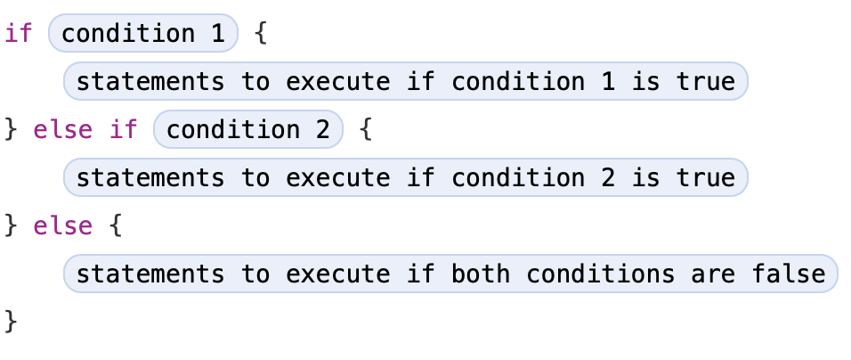
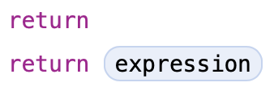
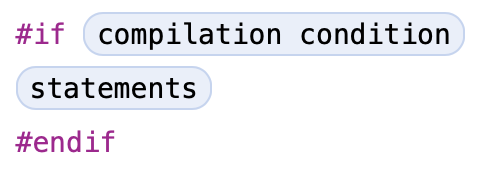

# Statements

最終更新日: 2021/6/13

Swift では、単純な文、コンパイラ制御文、および制御フロー文の 3 種類の文があります。単純な文は最も一般的で、式または宣言で構成されています。コンパイラ制御文により、プログラムはコンパイラの動作を変更し、条件付きコンパイルブロックと行制御文が含まれます。

制御フロー文は、プログラム内の実行の流れを制御するために使用されます。Swift には、ループ文、分岐文、および制御転送文を含む、いくつかの種類の制御フロー文があります。ループ文はコードブロックを繰り返し実行できるようにし、分岐文は特定の条件が満たされたときにのみ特定のコードブロックを実行できるようにし、制御転送文はコードが実行される順序を変更する方法を提供します。さらに、Swift は、スコープを導入し、エラーをキャッチして処理するための `do` 文、および現在のスコープが終了する直前のクリーンアップアクションを実行するための `defer` 文を提供します。

セミコロン(`;`)は任意の文の後に書くことができ、同じ行に複数の文が書かれている場合に、それらを分離するために使用されます。

> GRAMMAR OF A STATEMENT  
> statement → [expression](https://docs.swift.org/swift-book/ReferenceManual/Expressions.html#grammar_expression)  `;`<sub>*opt*</sub>  
> statement → [declaration](https://docs.swift.org/swift-book/ReferenceManual/Declarations.html#grammar_declaration)  `;`<sub>*opt*</sub>  
> statement → [loop-statement](https://docs.swift.org/swift-book/ReferenceManual/Statements.html#grammar_loop-statement)  `;`<sub>*opt*</sub>  
> statement → [branch-statement](https://docs.swift.org/swift-book/ReferenceManual/Statements.html#grammar_branch-statement)  `;`<sub>*opt*</sub>  
> statement → [labeled-statement](https://docs.swift.org/swift-book/ReferenceManual/Statements.html#grammar_labeled-statement)  `;`<sub>*opt*</sub>  
> statement → [control-transfer-statement](https://docs.swift.org/swift-book/ReferenceManual/Statements.html#grammar_control-transfer-statement)  `;`<sub>*opt*</sub>  
> statement → [defer-statement](https://docs.swift.org/swift-book/ReferenceManual/Statements.html#grammar_defer-statement)  `;`<sub>*opt*</sub>  
> statement → [do-statement](https://docs.swift.org/swift-book/ReferenceManual/Statements.html#grammar_do-statement)  `;`<sub>*opt*</sub>  
> statement → [compiler-control-statement](https://docs.swift.org/swift-book/ReferenceManual/Statements.html#grammar_compiler-control-statement)  
> statements → [statement](https://docs.swift.org/swift-book/ReferenceManual/Statements.html#grammar_statement)  [statements](https://docs.swift.org/swift-book/ReferenceManual/Statements.html#grammar_statements)<sub>*opt*</sub>

## Loop Statements(ループ文)

ループ文では、ループで指定された条件に応じて、コードブロックを繰り返し実行できます。Swift には 3 つのループ文があります。`for-in` 文、`while` 文、および `repeat-while` 文です。

ループ文内の制御フローは、`break` 文と `continue` 文によって変更でき、下記の [Break Statement](#break-statementbreak文)と[Continue Statement](#continue-statementcontinue文)で説明します。

> GRAMMAR OF A LOOP STATEMENT  
> loop-statement → [for-in-statement](https://docs.swift.org/swift-book/ReferenceManual/Statements.html#grammar_for-in-statement)  
> loop-statement → [while-statement](https://docs.swift.org/swift-book/ReferenceManual/Statements.html#grammar_while-statement)  
> loop-statement → [repeat-while-statement](https://docs.swift.org/swift-book/ReferenceManual/Statements.html#grammar_repeat-while-statement)

### For-In Statement(For-In文)

`for-in` 文は、[Sequence](https://developer.apple.com/documentation/swift/sequence)に準拠したコレクション(または任意の型)内の各項目ごとに 1 回のコードブロックを実行できます。

`for-in` 文の形式は次のとおりです:


`makeIterator()` メソッドは、[IteratorProtocol](https://developer.apple.com/documentation/swift/iteratorprotocol)プロトコルに準拠した型のイテレータ型の値を取得するために、collection 式で呼び出されます。プログラムは、イテレータ上で `next()` メソッドを呼び出すことによってループの実行を開始します。返された値が `nil` ではない場合、item に代入され、プログラムは statements を実行し、再びループの先頭から実行を続行します。それ以外の場合、プログラムは値の代入や、statements を実行せず、`for-in` 文の実行は終了しています。

> GRAMMAR OF A FOR-IN STATEMENT  
> for-in-statement → `for` `case`<sub>*opt*</sub> [pattern](https://docs.swift.org/swift-book/ReferenceManual/Patterns.html#grammar_pattern)  `in` [expression](https://docs.swift.org/swift-book/ReferenceManual/Expressions.html#grammar_expression)  [where-clause](https://docs.swift.org/swift-book/ReferenceManual/Statements.html#grammar_where-clause)<sub>*opt*</sub> [code-block](https://docs.swift.org/swift-book/ReferenceManual/Declarations.html#grammar_code-block)

### While Statement(While文)

`while` 文は、条件が true な限り、コードブロックを繰り返し実行できます。

`while` 文の形式は次のとおりです:


`while` 文は次のように実行されます。

1. condition が評価されます
`true` の場合、実行はステップ 2 に続きます。`false` の場合、プログラムは `while` 文の実行を終了します

2. プログラムは statements を実行し、実行はステップ 1 に戻ります

condition の値は、statements が実行される前に評価されるため、`while` 文内の statements は 0 回以上実行されます。

condition の値は、`Bool` 型または `Bool` にブリッジされた型でなければなりません。[Optional Binding](./../language-guide/the-basics.md#optional-bindingオプショナルバインディング)で説明したように、条件はオプショナルバインディング宣言にすることもできます。

> GRAMMAR OF A WHILE STATEMENT  
> while-statement → `while` [condition-list](https://docs.swift.org/swift-book/ReferenceManual/Statements.html#grammar_condition-list)  [code-block](https://docs.swift.org/swift-book/ReferenceManual/Declarations.html#grammar_code-block)  
> condition-list → [condition](https://docs.swift.org/swift-book/ReferenceManual/Statements.html#grammar_condition) \|  [condition](https://docs.swift.org/swift-book/ReferenceManual/Statements.html#grammar_condition)  `,` [condition-list](https://docs.swift.org/swift-book/ReferenceManual/Statements.html#grammar_condition-list)  
> condition → [expression](https://docs.swift.org/swift-book/ReferenceManual/Expressions.html#grammar_expression) \|  [availability-condition](https://docs.swift.org/swift-book/ReferenceManual/Statements.html#grammar_availability-condition) \|  [case-condition](https://docs.swift.org/swift-book/ReferenceManual/Statements.html#grammar_case-condition) \|  [optional-binding-condition](https://docs.swift.org/swift-book/ReferenceManual/Statements.html#grammar_optional-binding-condition)  
> case-condition → `case` [pattern](https://docs.swift.org/swift-book/ReferenceManual/Patterns.html#grammar_pattern)  [initializer](https://docs.swift.org/swift-book/ReferenceManual/Declarations.html#grammar_initializer)  
> optional-binding-condition → `let` [pattern](https://docs.swift.org/swift-book/ReferenceManual/Patterns.html#grammar_pattern)  [initializer](https://docs.swift.org/swift-book/ReferenceManual/Declarations.html#grammar_initializer) \|  `var` [pattern](https://docs.swift.org/swift-book/ReferenceManual/Patterns.html#grammar_pattern)  [initializer](https://docs.swift.org/swift-book/ReferenceManual/Declarations.html#grammar_initializer)

### Repeat-While Statement(Repeat-While文)

`repeat-while` 文は、条件が true な限り、コードブロックを 1 回以上実行できます。

`repeat-while` 文の形式は次のとおりです:


`repeat-while` 文は次のように実行されます。

1. プログラムは statements を実行し、実行はステップ 2 に進みます

2. condition が評価されます
`true` の場合、実行はステップ 1 に戻ります。`false` の場合、プログラムは `repeat-while` 文の実行を終了します

condition の値は statements の実行後に評価されるため、`repeat-while` 文内の文は少なくとも 1 回実行されます。

condition の値は、`Bool` 型または `Bool` にブリッジされた型にする必要があります。[Optional Binding](./../language-guide/the-basics.md#optional-bindingオプショナルバインディング)で説明したように、条件はオプショナルバインディング宣言にすることもできます。

> GRAMMAR OF A REPEAT-WHILE STATEMENT  
> repeat-while-statement → `repeat` [code-block](https://docs.swift.org/swift-book/ReferenceManual/Declarations.html#grammar_code-block)  `while` [expression](https://docs.swift.org/swift-book/ReferenceManual/Expressions.html#grammar_expression)

## Branch Statements(分岐文)

分岐文を使用すると、プログラムは 1 つ以上の条件の値に応じてコードの特定の部分を実行できます。分岐文で指定された条件の値は、プログラムの分岐方法、したがって実行されるコードブロックを制御します。Swift には、`if` 文、`guard` 文、および `switch` 文の 3 つの分岐文があります。

`if` 文または `switch` 文の制御フローは `break` 文によって変更できます。これについては、下記の [Break Statement](#break-statementbreak文)で説明します。

> GRAMMAR OF A BRANCH STATEMENT  
> branch-statement → [if-statement](https://docs.swift.org/swift-book/ReferenceManual/Statements.html#grammar_if-statement)  
> branch-statement → [guard-statement](https://docs.swift.org/swift-book/ReferenceManual/Statements.html#grammar_guard-statement)  
> branch-statement → [switch-statement](https://docs.swift.org/swift-book/ReferenceManual/Statements.html#grammar_switch-statement)

### If Statement(If文)

`if` 文は、1 つ以上の条件の評価に基づいてコードを実行するために使用されます。

`if` 文には 2 つの基本的な形式があります。それぞれの形式で、開閉中括弧(`{}`)が必要です。

最初の形式では、条件が true の場合にのみコードを実行でき、形式は次のとおりです:


`if` 文の 2 番目の形式は、追加の(`else` キーワードによって導入される)else 句を提供し、条件が true の場合にコードの一部を実行し、false の場合にコードの別の部分を実行するために使用されます。else 句が 1 つ存在する場合、`if` 文の形式は次のとおりです:


`if` 文の else 句には、複数の条件を検証するための別の `if` 文を含めることができます。このように連鎖された `if` 文の形式は次のとおりです:



`if` 文の条件の値は、`Bool` 型または `Bool` にブリッジされた型にする必要があります。[Optional Binding](./../language-guide/the-basics.md#optional-bindingオプショナルバインディング)で説明したように、条件はオプショナルバインディング宣言にすることもできます。

> GRAMMAR OF AN IF STATEMENT  
> if-statement → `if` [condition-list](https://docs.swift.org/swift-book/ReferenceManual/Statements.html#grammar_condition-list)  [code-block](https://docs.swift.org/swift-book/ReferenceManual/Declarations.html#grammar_code-block)  [else-clause](https://docs.swift.org/swift-book/ReferenceManual/Statements.html#grammar_else-clause)<sub>*opt*</sub>  
> else-clause → `else` [code-block](https://docs.swift.org/swift-book/ReferenceManual/Declarations.html#grammar_code-block) \|  `else` [if-statement](https://docs.swift.org/swift-book/ReferenceManual/Statements.html#grammar_if-statement)

### Guard Statement(Guard文)

`guard` 文は、1 つ以上の条件が満たされない場合に、プログラム制御をスコープ外に転送するために使用されます。

`guard` 文の形式は次のとおりです:


`guard` 文の条件の値は、`Bool` 型または `Bool` にブリッジされた型にする必要があります。[Optional Binding](./../language-guide/the-basics.md#optional-bindingオプショナルバインディング)で説明したように、条件はオプショナルバインディング宣言にすることもできます。

`guard` 文条件のオプショナルバインディング宣言から定数または変数へ値を代入することができ、`guard` 文を囲んでいるスコープの後の部分で使用できます。

`guard` 文の else 句は必須で、次の文のいずれかを使用して、`Never` 型の戻り値を持つ関数を呼び出すか、`guard` 文を呼び出したスコープ外にプログラム制御を転送する必要があります。

* `return`
* `break`
* `continue`
* `throw`

制御転送文については、下記の[Control Transfer Statements](#control-transfer-statements制御転送文)で説明します。`Never` 型の戻り値を持つ関数の詳細については、[Functions that Never Return](./declarations.md#functions-that-never-return)を参照ください。

> GRAMMAR OF A GUARD STATEMENT  
> guard-statement → `guard` [condition-list](https://docs.swift.org/swift-book/ReferenceManual/Statements.html#grammar_condition-list)  `else` [code-block](https://docs.swift.org/swift-book/ReferenceManual/Declarations.html#grammar_code-block)

### Switch Statement(Switch文)

`switch` 文を使用すると、制御式の値に応じて特定のコードブロックを実行できます。

`switch` 文の形式は次のとおりです。


`switch` 文の control expression が評価され、それぞれの場合に指定されたパターンと比較されます。一致するものが見つかった場合、プログラムはそのケースの範囲内の statements を実行します。各ケースのスコープを空にすることはできません。そのため、各ケースラベルのコロン(`:`)の後に少なくとも 1 つの文を含める必要があります。コードを実行する予定がない場合は、単一の `break` 文を使用します。

コードが分岐できる式の値は非常に柔軟です。例えば、整数や文字などのスカラー型の値に加えて、浮動小数点数、文字列、タプル、独自で作成したクラスのインスタンス、オプショナルなど、任意の型の値で分岐できます。control expression の値は、列挙型内のケースと一致しているかや、指定された値の範囲に含まれているかどうかを確認することもできます。`switch` 文でこれらの様々な種類の値を使用する方法の例については、[Control Flow](./../language-guide/control-flow.md)の [Switch](./../language-guide/control-flow.md#switch)を参照ください。

`switch` のケースには、各パターンの後に where 句を含めることができます。where 句は、`where` キーワードの後に​​式が続くことで導入され、ケースのパターンが control expression に一致すると見なされる前に追加の条件を提供するために使用されます。where 句が存在する場合、関連するケース内の statements は、control expression の値がケースのパターンの 1 つと一致し、where 句の式が `true` と評価された場合にのみ実行されます。例えば、control expression は、`(1、1)` など、同じ値の 2 つの要素を含むタプルの場合にのみ、下記の例のケースに一致します。

```swift
case let (x, y) where x == y:
```

上記の例が示すように、ケースのパターンは、`let` キーワードを使用して定数をバインドすることもできます(`var` キーワードを使用して変数をバインドすることもできます)。これらの定数（または変数）は、対応する `where` 句で、およびケースのスコープ内で参照できます。control expression に一致する複数のパターンがケース含まれている場合、全てのパターンで同じ定数または変数にバインディングされ、バインドされた各変数または定数は同じ型でなければなりません。

`switch` 文には、`default` キーワードによって導入されたデフォルトのケースを含めることもできます。デフォルトのケース内のコードは、他のケースが制御式に一致しない場合にのみ実行されます。`switch` 文には、デフォルトのケースを 1 つだけ含めることができます。これは、`switch` 文の最後に書く必要があります。

パターンマッチングの実際の実行順序、特にケース内のパターンの評価順序は指定されていませんが、`switch` 文でのパターンマッチングは、評価がソースの順序、つまり、コードに現れる順序で評価されているかのように動作します。その結果、複数のケースに同じ値と評価されるパターンが含まれていて、制御式の値と一致する可能性がある場合、プログラムは最初に一致したケース内のコードのみを実行します。

#### Switch Statements Must Be Exhaustive(Switch文は網羅的でなければならない)

---

Swift では、制御式の型が取り得る全ての値は、ケースの少なくとも 1 つのパターンと一致する必要があります。これが不可能な場合(例えば、制御式の型が `Int` の場合)、要件を満たすためにデフォルトのケースを含めることができます。

#### Switching Over Future Enumeration Cases(列挙型の将来のケースのスイッチング)

---

nonfrozen の列挙型は、アプリをコンパイルして出荷した後でも、将来的に新しい列挙ケースを追加する可能性のある特別な種類の列挙型です。nonfrozen 列挙型をスイッチングするには、特別な考慮が必要です。ライブラリの作成者が列挙型を nonfrozen としてマークすると、新しい列挙ケースを追加する権利が確保され、その列挙型を利用するコードは、再コンパイルせずにその将来のケースを処理しなければなりません。ライブラリエボリューションモード(*library evolution mode*)でコンパイルされたコード、標準ライブラリのコード、Apple フレームワーク用の Swift オーバーレイ、C 言語および Objective-C のコードは、nonfrozen 列挙型を宣言できます。frozen および nonfrozen の列挙型については、[frozen](./attributes.md#frozen)を参照ください。

nonfrozen 列挙型の値をスイッチングするときは、列挙型の全てのケースに対応する `switch` ケースがすでにある場合でも、常にデフォルトのケースを含める必要があります。`@unknown` 属性をデフォルトのケースに適用できます。これは、デフォルトのケースが、将来追加される列挙ケースにのみ一致する必要があることを示します。デフォルトのケースがコンパイラ時に既知の列挙ケースと一致する場合、Swift は警告を生成します。この将来のケースへの警告は、ライブラリの作成者が、新しいケースを列挙型に追加したことを知らせてくれます。

次の例では、標準ライブラリの [Mirror.AncestorRepresentation](https://developer.apple.com/documentation/swift/mirror/ancestorrepresentation) 列挙型の 3 つの既存のケース全てをスイッチングしています。将来、ケースを追加すると、コンパイラは、新しいケースを考慮に入れるために `switch` 文を更新する必要があることを示す警告を生成します。

```swift
let representation: Mirror.AncestorRepresentation = .generated
switch representation {
case .customized:
    print("Use the nearest ancestor’s implementation.")
case .generated:
    print("Generate a default mirror for all ancestor classes.")
case .suppressed:
    print("Suppress the representation of all ancestor classes.")
@unknown default:
    print("Use a representation that was unknown when this code was compiled.")
}
// "Generate a default mirror for all ancestor classes."
```

#### Execution Does Not Fall Through Cases Implicitly(暗黙的に通り抜けない)

---

一致したケース内のコードの実行が終了すると、プログラムは `switch` 文を終了します。プログラムの実行は続行されないか、次のケースまたはデフォルトのケースに「通り抜け」ません。あるケースから次のケースまで実行を継続したい場合、`fallthrough` キーワードで構成される `fallthrough` 文を明示的に含めます。`fallthrough` 文の詳細については、下記の[Fallthrough Statement](#fallthrough-statementfallthrough文)を参照ください。

> GRAMMAR OF A SWITCH STATEMENT  
> switch-statement → `switch` [expression](https://docs.swift.org/swift-book/ReferenceManual/Expressions.html#grammar_expression)  `{` [switch-cases](https://docs.swift.org/swift-book/ReferenceManual/Statements.html#grammar_switch-cases)<sub>*opt*</sub> `}`  
> switch-cases → [switch-case](https://docs.swift.org/swift-book/ReferenceManual/Statements.html#grammar_switch-case)  [switch-cases](https://docs.swift.org/swift-book/ReferenceManual/Statements.html#grammar_switch-cases)<sub>*opt*</sub>  
> switch-case → [case-label](https://docs.swift.org/swift-book/ReferenceManual/Statements.html#grammar_case-label)  [statements](https://docs.swift.org/swift-book/ReferenceManual/Statements.html#grammar_statements)  
> switch-case → [default-label](https://docs.swift.org/swift-book/ReferenceManual/Statements.html#grammar_default-label)  [statements](https://docs.swift.org/swift-book/ReferenceManual/Statements.html#grammar_statements)  
> switch-case → [conditional-switch-case](https://docs.swift.org/swift-book/ReferenceManual/Statements.html#grammar_conditional-switch-case)  
> case-label → [attributes](https://docs.swift.org/swift-book/ReferenceManual/Attributes.html#grammar_attributes)<sub>*opt*</sub> `case` [case-item-list](https://docs.swift.org/swift-book/ReferenceManual/Statements.html#grammar_case-item-list)  `:`  
> case-item-list → [pattern](https://docs.swift.org/swift-book/ReferenceManual/Patterns.html#grammar_pattern)  [where-clause](https://docs.swift.org/swift-book/ReferenceManual/Statements.html#grammar_where-clause)<sub>*opt*</sub> \|  [pattern](https://docs.swift.org/swift-book/ReferenceManual/Patterns.html#grammar_pattern)  [where-clause](https://docs.swift.org/swift-book/ReferenceManual/Statements.html#grammar_where-clause)<sub>*opt*</sub> `,` [case-item-list](https://docs.swift.org/swift-book/ReferenceManual/Statements.html#grammar_case-item-list)  
> default-label → [attributes](https://docs.swift.org/swift-book/ReferenceManual/Attributes.html#grammar_attributes)<sub>*opt*</sub> `default` `:`  
> where-clause → `where` [where-expression](https://docs.swift.org/swift-book/ReferenceManual/Statements.html#grammar_where-expression)  
> where-expression → [expression](https://docs.swift.org/swift-book/ReferenceManual/Expressions.html#grammar_expression)  
> conditional-switch-case → [switch-if-directive-clause](https://docs.swift.org/swift-book/ReferenceManual/Statements.html#grammar_switch-if-directive-clause)  [switch-elseif-directive-clauses](https://docs.swift.org/swift-book/ReferenceManual/Statements.html#grammar_switch-elseif-directive-clauses)<sub>*opt*</sub> [switch-else-directive-clause](https://docs.swift.org/swift-book/ReferenceManual/Statements.html#grammar_switch-else-directive-clause)<sub>*opt*</sub> [endif-directive](https://docs.swift.org/swift-book/ReferenceManual/Statements.html#grammar_endif-directive)  
> switch-if-directive-clause → [if-directive](https://docs.swift.org/swift-book/ReferenceManual/Statements.html#grammar_if-directive)  [compilation-condition](https://docs.swift.org/swift-book/ReferenceManual/Statements.html#grammar_compilation-condition)  [switch-cases](https://docs.swift.org/swift-book/ReferenceManual/Statements.html#grammar_switch-cases)<sub>*opt*</sub>  
> switch-elseif-directive-clauses → [elseif-directive-clause](https://docs.swift.org/swift-book/ReferenceManual/Statements.html#grammar_elseif-directive-clause)  [switch-elseif-directive-clauses](https://docs.swift.org/swift-book/ReferenceManual/Statements.html#grammar_switch-elseif-directive-clauses)<sub>*opt*</sub>  
> switch-elseif-directive-clause → [elseif-directive](https://docs.swift.org/swift-book/ReferenceManual/Statements.html#grammar_elseif-directive)  [compilation-condition](https://docs.swift.org/swift-book/ReferenceManual/Statements.html#grammar_compilation-condition)  [switch-cases](https://docs.swift.org/swift-book/ReferenceManual/Statements.html#grammar_switch-cases)<sub>*opt*</sub>  
> switch-else-directive-clause → [else-directive](https://docs.swift.org/swift-book/ReferenceManual/Statements.html#grammar_else-directive)  [switch-cases](https://docs.swift.org/swift-book/ReferenceManual/Statements.html#grammar_switch-cases)<sub>*opt*</sub>

## Labeled Statement(ラベルあり文)

ループ文、`if` 文、`switch` 文、または `do` 文の前に文ラベルを付けることができます。文ラベルは、ラベルの名前の直後にコロン(`:`)が続きます。下記の [Break](#break-statementbreak文)と[Continue](#continue-statementcontinue文)で説明するように、`break` 文と `continue` 文で文ラベルを使用して、ループ文または `switch` 文の制御フローをどのように変更したいのかを明示できます。

ラベルあり文のスコープは、文ラベルに続く文全体です。ラベルあり文はネストできますが、各文ラベルの名前を一意にする必要があります。

文ラベルの詳細および使用例については、[Control Flow](./../language-guide/control-flow.md)の[Labeled Statements](./../language-guide/control-flow.md#labeled-statementsラベル付き文)を参照ください。

> GRAMMAR OF A LABELED STATEMENT  
> labeled-statement → [statement-label](https://docs.swift.org/swift-book/ReferenceManual/Statements.html#grammar_statement-label)  [loop-statement](https://docs.swift.org/swift-book/ReferenceManual/Statements.html#grammar_loop-statement)  
> labeled-statement → [statement-label](https://docs.swift.org/swift-book/ReferenceManual/Statements.html#grammar_statement-label)  [if-statement](https://docs.swift.org/swift-book/ReferenceManual/Statements.html#grammar_if-statement)  
> labeled-statement → [statement-label](https://docs.swift.org/swift-book/ReferenceManual/Statements.html#grammar_statement-label)  [switch-statement](https://docs.swift.org/swift-book/ReferenceManual/Statements.html#grammar_switch-statement)  
> labeled-statement → [statement-label](https://docs.swift.org/swift-book/ReferenceManual/Statements.html#grammar_statement-label)  [do-statement](https://docs.swift.org/swift-book/ReferenceManual/Statements.html#grammar_do-statement)  
> statement-label → [label-name](https://docs.swift.org/swift-book/ReferenceManual/Statements.html#grammar_label-name)  `:`   
> label-name → [identifier](https://docs.swift.org/swift-book/ReferenceManual/LexicalStructure.html#grammar_identifier)

## Control Transfer Statements(制御転送文)

制御転送文は、プログラム制御をあるコードから別のコードに無条件に転送することにより、プログラム内のコードが実行される順序を変更できます。Swift には、`break` 文、`continue` 文、`fallthrough` 文、`return` 文、および `throw` 文の 5 つの制御転送文があります。

> GRAMMAR OF A CONTROL TRANSFER STATEMENT  
> control-transfer-statement → [break-statement](https://docs.swift.org/swift-book/ReferenceManual/Statements.html#grammar_break-statement)  
> control-transfer-statement → [continue-statement](https://docs.swift.org/swift-book/ReferenceManual/Statements.html#grammar_continue-statement)  
> control-transfer-statement → [fallthrough-statement](https://docs.swift.org/swift-book/ReferenceManual/Statements.html#grammar_fallthrough-statement)  
> control-transfer-statement → [return-statement](https://docs.swift.org/swift-book/ReferenceManual/Statements.html#grammar_return-statement)  
> control-transfer-statement → [throw-statement](https://docs.swift.org/swift-book/ReferenceManual/Statements.html#grammar_throw-statement)

### Break Statement(Break文)

`break` 文は、ループ、`if` 文、または `switch` 文のプログラムの実行を終了します。下記に示すように、`break` 文は、`break` キーワードのみで構成することも、`break` キーワードの後に文ラベルを続けることもできます。


`break` 文の後に文ラベルが続く場合、そのラベルで指定されたループ、`if` 文、または `switch` 文のプログラム実行を終了します。

`break` 文の後に文ラベルが続かない場合は、`switch` 文またはそれが登場する最も内側のループ文のプログラムの実行を終了します。ラベルのない `break` 文を使用して `if` 文から抜け出すことはできません。

どちらの場合も、プログラム制御は、ループまたは `switch` 文（存在する場合）で囲まれているコードの次の行に移ります。

`break` 文の使用方法の例については、[Break](#break-statementbreak文)と[Control Flow](./../language-guide/control-flow.md)の[Labeled Statements](./../language-guide/control-flow.md#labeled-statementsラベル付き文)を参照ください。

> GRAMMAR OF A BREAK STATEMENT  
> break-statement → `break` [label-name](https://docs.swift.org/swift-book/ReferenceManual/Statements.html#grammar_label-name)<sub>*opt*</sub>

### Continue Statement(Continue文)

`continue` 文は、ループ文の現在の反復のプログラム実行を終了しますが、ループ文の実行を停止しません。次に示すように、`continue` 文は `continue` キーワードのみで構成することも、`continue` キーワードとそれに続く文ラベルで構成することもできます。


`continue` 文の後に文ラベルが続く場合、そのラベルで指定されたループの現在のイテレーションを終了します。

`continue` 文の後に文ラベルが続かない場合、それが登場する最も内側のループの現在のイテレーションを終了します。

どちらの場合も、プログラム制御は、それを囲むループ文の条件に移されます。

`for` 文では、increment 式はループの本体の実行後に評価されるため、`continue` 文の実行後も increment 式は評価されます。

`continue` 文の使用方法の例については、[Continue](#continue-statementcontinue文)と[Control Flow](./../language-guide/control-flow.md)の[Labeled Statements](./../language-guide/control-flow.md#labeled-statementsラベル付き文)を参照ください。

> GRAMMAR OF A CONTINUE STATEMENT  
> continue-statement → `continue` [label-name](https://docs.swift.org/swift-book/ReferenceManual/Statements.html#grammar_label-name)<sub>*opt*</sub>

### Fallthrough Statement(Fallthrough文)

`fallthrough` 文は `fallthrough` キーワードで構成され、`switch` 文のケースブロックでのみ発生します。`fallthrough` 文により、プログラムの実行は、`switch` 文の 1 つのケースから次のケースに続行されます。ケースラベルのパターンが `switch` 文の制御式の値と一致しない場合でも、プログラムの実行は次のケースに進みます。

`fallthrough` 文は、ケースブロックの最後の文としてだけでなく、`switch` 文内のどこにでも表示できますが、最後のケースブロックでは使用できません。また、パターンに値バインディングのパターンが含まれているケースのブロックに制御を移すこともできません。

`switch` 文で `fallthrough` 文を使用する方法の例については、[Control Flow](./../language-guide/control-flow.md)の[Control Transfer Statements](./../language-guide/control-flow.md#control-transfer-statements制御転送文)を参照ください。

> GRAMMAR OF A FALLTHROUGH STATEMENT  
> fallthrough-statement → `fallthrough`

### Return Statement(Return文)

`return` 文は、関数またはメソッド定義の本文で登場し、プログラムの実行を呼び出し元の関数またはメソッドに戻します。プログラムの実行は、関数またはメソッドの呼び出しの直後から続行されます。

下記に示すように、`return` 文は `return` キーワードのみで構成することも、`return` キーワードとそれに続く式で構成することもできます。



`return` 文の後に式が続く場合、式の値は呼び出し元の関数またはメソッドに返されます。式の値が関数またはメソッドで宣言された戻り値の型と一致しない場合、式の値は、呼び出し元の関数またはメソッドに返される前に戻り値の型に変換されます。

> NOTE  
> [Failable Initializers](./../language-guide/initialization.md#failable-initializers敗可能イニシャライザ)で説明されているように、失敗可能なイニシャライザで特別な形式の `return` 文（`return nil`）を使用して、イニシャライザの失敗を示すことができます。

`return` 文の後に式がない場合は、値を返さない関数またはメソッド(つまり、関数またはメソッドの戻り値の型が `Void` または `()` の場合）のみで使用できます

> GRAMMAR OF A RETURN STATEMENT  
> return-statement → `return` [expression](https://docs.swift.org/swift-book/ReferenceManual/Expressions.html#grammar_expression)<sub>*opt*</sub>

### Throw Statement(Throw文)

`throw` 文は、エラーをスローする関数またはメソッドの本文、または型が `throws` キーワードでマークされているクロージャ式の本文で使用できます。

`throw` 文により、プログラムは現在のスコープの実行を終了し、それを囲むスコープへエラーを伝播します。スローされたエラーは、`do` 文の `catch` 句によって処理されるまで伝播し続けます。

下記に示すように、`throw` 文は、`throw` キーワードとそれに続く式で構成されます。


式の値は、`Error` プロトコルに準拠する型でなければなりません。

`throw` 文の使用方法の例については、[Error Handling](./../language-guide/error-handling.md)の[Propagating Errors Using Throwing Functions](./../language-guide/error-handling.md#propagating-errors-using-throwing-functionsスロー関数を使用したエラーの伝播)を参照ください。

> GRAMMAR OF A THROW STATEMENT  
> throw-statement → `throw` [expression](https://docs.swift.org/swift-book/ReferenceManual/Expressions.html#grammar_expression)

## Defer Statement(Defer文)

`defer` 文は、`defer` 文が使用されるスコープ外にプログラム制御を転送する直前にコードを実行するために使用されます。

`defer` 文の形式は次のとおりです:


`defer` 文内の文は、プログラム制御がどのように転送されても実行されます。つまり、`defer` 文を使用して、例えば、ファイル記述子を閉じるなどの手動のリソース管理や、エラーがスローされた場合でも実行する必要のあるアクションを実行できます。

複数の `defer` 文が同じスコープに表示される場合、それらが登場する順序は、実行される順序の逆になります。特定のスコープで最後の `defer` 文を最初に実行するということは、その最後の `defer` 文内の文が、他の `defer` 文によってクリーンアップされるリソースを参照できることを意味します。

```swift
func f() {
    defer { print("First defer") }
    defer { print("Second defer") }
    print("End of function")
}
f()
// "End of function"
// "Second defer"
// "First defer"
```

`defer` 文内の文は、プログラム制御を `defer` 文の外部に移すことはできません。

> GRAMMAR OF A DEFER STATEMENT  
> defer-statement → `defer` [code-block](https://docs.swift.org/swift-book/ReferenceManual/Declarations.html#grammar_code-block)

## Do Statement(Do文)

`do` 文は、新しいスコープを導入するために使用され、1 つ以上の `catch` 句を含めることができます。これには、定義されたエラー条件に一致するパターンが含まれます。`do` 文のスコープで宣言された変数と定数は、そのスコープ内でのみアクセスできます。

Swift の `do` 文は、コードブロックを区切るために使用される C 言語の大括弧(`{}`)に似ており、実行時にパフォーマンスコストが発生しません。

`do` 文の形式は次のとおりです:


`do` ブロック内のいずれかの文がエラーをスローした場合、プログラム制御は、パターンがエラーに一致する最初の `catch` 句に移ります。どの句も一致しない場合、エラーは周囲のスコープに伝播します。エラーがトップレベルでも処理されない場合、プログラムの実行は実行時エラーで停止します。

`switch` 文と同様に、コンパイラは `catch` 句が全てのエラーを網羅しているかどうかを推論しようとします。そのような決定ができ​​る場合、エラーは処理されたと見なされます。そうしないと、エラーがスコープ外に伝播する可能性があります。つまり、エラーは `catch` 句内で処理するか、関数を `throws` で宣言する必要があります。

複数のパターンを持つ `catch` 句は、そのパターンのいずれかにエラーが一致する場合、エラーに一致すると見なされます。`catch` 句に複数のパターンが含まれている場合、全てのパターンで同じ定数または変数にバインドされる必要があり、バインドされた各変数または定数は、`catch` 句の全てのパターンで同じ型でなければなりません。

エラーが確実に処理されるようにするには、ワイルドカードパターン(`_`)など、全てのエラーに一致するパターンで `catch` 句を使用します。`catch` 句でパターンが指定されていない場合、`catch` 句は全てのエラーと一致し、`error` という名前のローカル定数にバインドします。`catch` 句で使用できるパターンの詳細については、[Patterns](./patterns.md)を参照ください。

複数の `catch` 句を指定して `do` 文を使用する方法の例については、[Handling Errors](./../language-guide/error-handling.md#handling-errorsエラー処理)を参照ください。

> GRAMMAR OF A DO STATEMENT  
> do-statement → `do` [code-block](https://docs.swift.org/swift-book/ReferenceManual/Declarations.html#grammar_code-block)  [catch-clauses](https://docs.swift.org/swift-book/ReferenceManual/Statements.html#grammar_catch-clauses)<sub>*opt*</sub>  
> catch-clauses → [catch-clause](https://docs.swift.org/swift-book/ReferenceManual/Statements.html#grammar_catch-clause)  [catch-clauses](https://docs.swift.org/swift-book/ReferenceManual/Statements.html#grammar_catch-clauses)<sub>*opt*</sub>  
> catch-clause → `catch` [catch-pattern-list](https://docs.swift.org/swift-book/ReferenceManual/Statements.html#grammar_catch-pattern-list)<sub>*opt*</sub> [code-block](https://docs.swift.org/swift-book/ReferenceManual/Declarations.html#grammar_code-block)  
> catch-pattern-list → [catch-pattern](https://docs.swift.org/swift-book/ReferenceManual/Statements.html#grammar_catch-pattern) \|  [catch-pattern](https://docs.swift.org/swift-book/ReferenceManual/Statements.html#grammar_catch-pattern)  `,` [catch-pattern-list](https://docs.swift.org/swift-book/ReferenceManual/Statements.html#grammar_catch-pattern-list)  
> catch-pattern → [pattern](https://docs.swift.org/swift-book/ReferenceManual/Patterns.html#grammar_pattern)  [where-clause](https://docs.swift.org/swift-book/ReferenceManual/Statements.html#grammar_where-clause)<sub>*opt*</sub>

## Compiler Control Statements(コンパイラ制御文)

コンパイラ制御文を使用すると、プログラムはコンパイラの動作を変更できます。Swift には、3 つのコンパイラ制御文があります。条件付きコンパイルブロックと、行制御文と、コンパイル時診断文です。

> GRAMMAR OF A COMPILER CONTROL STATEMENT  
> compiler-control-statement → [conditional-compilation-block](https://docs.swift.org/swift-book/ReferenceManual/Statements.html#grammar_conditional-compilation-block)  
> compiler-control-statement → [line-control-statement](https://docs.swift.org/swift-book/ReferenceManual/Statements.html#grammar_line-control-statement)  
> compiler-control-statement → [diagnostic-statement](https://docs.swift.org/swift-book/ReferenceManual/Statements.html#grammar_diagnostic-statement)

### Conditional Compilation Block(条件付きコンパイルブロック)

条件付きコンパイルブロックを使用すると、1 つ以上のコンパイル条件の値に応じてコードを条件付きでコンパイルできます。

全ての条件付きコンパイルブロックは、`＃if` コンパイルディレクティブで始まり、`＃endif` コンパイルディレクティブで終わります。単純な条件付きコンパイルブロックの形式は次のとおりです。



`if` 文の条件とは異なり、コンパイル条件はコンパイル時に評価されます。その結果、文は、コンパイル時にコンパイル条件が `true` と評価された場合にのみ、コンパイルおよび実行されます。

コンパイル条件には、`true` および `false` のブールリテラル、`-D` コマンドラインフラグで使用される識別子、または下記の表にリストされているプラットフォーム条件のいずれかを含めることができます。

| **プラットフォーム条件** | **有効な引数** |
| :---: | :---: |
| `os()` | `macOS`, `iOS`, `watchOS`, `tvOS`, `Linux`, `Windows` |
| `arch()` | `i386`, `x86_64`, `arm`, `arm64` |
| `swift()` | `>=` または `<` の後ろにバージョン番号 |
| `compiler()` | `>=` または `<` の後ろにバージョン番号 |
| `canImport()` | モジュール名 |
| `targetEnvironment()` | `simulator`, `macCatalyst` |

`swift()` および `compiler()` プラットフォーム条件のバージョン番号は、メジャー番号、任意のマイナー番号、任意のパッチ番号などで構成され、バージョン番号の各部分をドット(`.`)で区切ります。比較演算子とバージョン番号の間にスペースがあってはなりません。コンパイラに渡される Swift バージョンの設定に関係なく、`compiler()` のバージョンはコンパイラのバージョンです。`swift()` のバージョンは、現在コンパイルされている言語バージョンです。例えば、Swift4.2 モードで Swift5 のコンパイラを使用してコードをコンパイルする場合、コンパイラのバージョンは `5` で、言語のバージョンは `4.2` です。これらの設定では、次のコードは 3 つのメッセージ全てを出力します:

```swift
#if compiler(>=5)
print("Compiled with the Swift 5 compiler or later")
#endif
#if swift(>=4.2)
print("Compiled in Swift 4.2 mode or later")
#endif
#if compiler(>=5) && swift(<5)
print("Compiled with the Swift 5 compiler or later in a Swift mode earlier than 5")
#endif
// "Compiled with the Swift 5 compiler or later"
// "Compiled in Swift 4.2 mode or later"
// "Compiled with the Swift 5 compiler or later in a Swift mode earlier than 5"
```

`canImport()` プラットフォーム条件の引数は、全てのプラットフォームに存在するとは限らないモジュールの名前です。この条件は、モジュールをインポートできるかどうかをテストしますが、実際にはインポートしません。モジュールが存在する場合、プラットフォーム条件は `true` を返します。それ以外の場合は、`false` を返します。

`targetEnvironment()` プラットフォーム条件は、指定された環境用にコードがコンパイルされているときに `true` を返します。それ以外の場合は、false を返します。

> NOTE  
> `arch（arm）` プラットフォーム条件は、ARM64 デバイスでは `true` を返しません。コードが 32 ビット iOS シミュレーター用にコンパイルされると、`arch（i386）` プラットフォーム条件は `true` を返します。

論理演算子 `&&`、`||`、および `！` を使用して、コンパイル条件を組み合わせたり、無効にしたり、グループ化に括弧を使用できます。これらの演算子は、通常のブール式を組み合わせるために使用される論理演算子と同じ結合規則と優先順位を持っています。

`if` 文と同様に、複数の条件分岐を追加して、様々なコンパイル条件を検証できます。`#elseif` 句を使用して、分岐をいくつでも追加できます。`#else` 句を使用して、最後の分岐を追加することもできます。複数のブランチを含む条件付きコンパイルブロックの形式は次のとおりです:


> NOTE  
> 条件付きコンパイルブロックの本文にある各文は、コンパイルされていない場合でも解析されます。ただし、コンパイル条件に `swift()` または `compiler()` プラットフォーム条件が含まれている場合は例外です。言語またはコンパイラのバージョンがプラットフォーム条件で指定されているものと一致する場合にのみ解析されます。この例外により、古いコンパイラが新しいバージョンの Swift で導入された構文を解析しないことが保証されます。

> GRAMMAR OF A CONDITIONAL COMPILATION BLOCK  
> conditional-compilation-block → [if-directive-clause](https://docs.swift.org/swift-book/ReferenceManual/Statements.html#grammar_if-directive-clause)  [elseif-directive-clauses](https://docs.swift.org/swift-book/ReferenceManual/Statements.html#grammar_elseif-directive-clauses)<sub>*opt*</sub> [else-directive-clause](https://docs.swift.org/swift-book/ReferenceManual/Statements.html#grammar_else-directive-clause)<sub>*opt*</sub> [endif-directive](https://docs.swift.org/swift-book/ReferenceManual/Statements.html#grammar_endif-directive)  
> if-directive-clause → [if-directive](https://docs.swift.org/swift-book/ReferenceManual/Statements.html#grammar_if-directive)  [compilation-condition](https://docs.swift.org/swift-book/ReferenceManual/Statements.html#grammar_compilation-condition)  [statements](https://docs.swift.org/swift-book/ReferenceManual/Statements.html#grammar_statements)<sub>*opt*</sub>  
> elseif-directive-clauses → [elseif-directive-clause](https://docs.swift.org/swift-book/ReferenceManual/Statements.html#grammar_elseif-directive-clause)  [elseif-directive-clauses](https://docs.swift.org/swift-book/ReferenceManual/Statements.html#grammar_elseif-directive-clauses)<sub>*opt*</sub>  
> elseif-directive-clause → [elseif-directive](https://docs.swift.org/swift-book/ReferenceManual/Statements.html#grammar_elseif-directive)  [compilation-condition](https://docs.swift.org/swift-book/ReferenceManual/Statements.html#grammar_compilation-condition)  [statements](https://docs.swift.org/swift-book/ReferenceManual/Statements.html#grammar_statements)<sub>*opt*</sub>  
> else-directive-clause → [else-directive](https://docs.swift.org/swift-book/ReferenceManual/Statements.html#grammar_else-directive)  [statements](https://docs.swift.org/swift-book/ReferenceManual/Statements.html#grammar_statements)<sub>*opt*</sub>  
> if-directive → `#if`  
> elseif-directive → `#elseif`  
> else-directive → `#else`  
> endif-directive → `#endif`  
> compilation-condition → [platform-condition](https://docs.swift.org/swift-book/ReferenceManual/Statements.html#grammar_platform-condition)  
> compilation-condition → [identifier](https://docs.swift.org/swift-book/ReferenceManual/LexicalStructure.html#grammar_identifier)  
> compilation-condition → [boolean-literal](https://docs.swift.org/swift-book/ReferenceManual/LexicalStructure.html#grammar_boolean-literal)  
> compilation-condition → `(` [compilation-condition](https://docs.swift.org/swift-book/ReferenceManual/Statements.html#grammar_compilation-condition)  `)`  
> compilation-condition → `!` [compilation-condition](https://docs.swift.org/swift-book/ReferenceManual/Statements.html#grammar_compilation-condition)  
> compilation-condition → [compilation-condition](https://docs.swift.org/swift-book/ReferenceManual/Statements.html#grammar_compilation-condition)  `&&` [compilation-condition](https://docs.swift.org/swift-book/ReferenceManual/Statements.html#grammar_compilation-condition)  
> compilation-condition → [compilation-condition](https://docs.swift.org/swift-book/ReferenceManual/Statements.html#grammar_compilation-condition)  `||` [compilation-condition](https://docs.swift.org/swift-book/ReferenceManual/Statements.html#grammar_compilation-condition)  
> platform-condition → `os` `(` [operating-system](https://docs.swift.org/swift-book/ReferenceManual/Statements.html#grammar_operating-system)  `)`  
> platform-condition → `arch` `(` [architecture](https://docs.swift.org/swift-book/ReferenceManual/Statements.html#grammar_architecture)  `)`  
> platform-condition → `swift` `(` `>=` [swift-version](https://docs.swift.org/swift-book/ReferenceManual/Statements.html#grammar_swift-version)  `)` \|  `swift` `(` `<` [swift-version](https://docs.swift.org/swift-book/ReferenceManual/Statements.html#grammar_swift-version)  `)`  
> platform-condition → `compiler` `(` `>=` [swift-version](https://docs.swift.org/swift-book/ReferenceManual/Statements.html#grammar_swift-version)  `)` \|  `compiler` `(` `<` [swift-version](https://docs.swift.org/swift-book/ReferenceManual/Statements.html#grammar_swift-version)  `)`  
> platform-condition → `canImport` `(` [module-name](https://docs.swift.org/swift-book/ReferenceManual/Statements.html#grammar_module-name)  `)`  
> platform-condition → `targetEnvironment` `(` [environment](https://docs.swift.org/swift-book/ReferenceManual/Statements.html#grammar_environment)  `)`  
> operating-system → `macOS` \|  `iOS` \|  `watchOS` \|  `tvOS` \|  `Linux` \|  `Windows`  
> architecture → `i386` \|  `x86_64` \|  `arm` \|  `arm64`  
> swift-version → [decimal-digits](https://docs.swift.org/swift-book/ReferenceManual/LexicalStructure.html#grammar_decimal-digits)  [swift-version-continuation](https://docs.swift.org/swift-book/ReferenceManual/Statements.html#grammar_swift-version-continuation)<sub>*opt*</sub>  
> swift-version-continuation → `.` [decimal-digits](https://docs.swift.org/swift-book/ReferenceManual/LexicalStructure.html#grammar_decimal-digits)  [swift-version-continuation](https://docs.swift.org/swift-book/ReferenceManual/Statements.html#grammar_swift-version-continuation)<sub>*opt*</sub>  
> module-name → [identifier](https://docs.swift.org/swift-book/ReferenceManual/LexicalStructure.html#grammar_identifier)  
> environment → `simulator` \|  `macCatalyst`

### Line Control Statement(行制御文)

行制御文は、コンパイルされるソースコードの行番号およびファイル名とは異なる可能性のある行番号およびファイル名を指定するために使用されます。行制御文を使用して、診断およびデバッグの目的で Swift が使用するソースコードの場所を変更します。

行制御文の形式は次のとおりです:


最初の形式は、行制御文に続くコード行から、`＃line`、`＃file`、`＃fileID`、および `#filePath` リテラル式の値を変更します。line number は `#line` の値を変更し、0 より大きい任意の整数リテラルです。file path は、`＃file`、`＃fileID`、および `#filePath` の値を変更する文字列リテラルです。指定された文字列が `#filePath` の値になり、文字列の最後のパスコンポーネントが `#fileID` の値として使用されます。`＃file`、`＃fileID`、および `#filePath` については、[Literal Expression](./expressions.md#literal-expressionリテラル式)を参照ください。

2 番目の形式の `#sourceLocation()` は、ソースコードの場所をデフォルトの行番号とファイルパスにリセットします。

> GRAMMAR OF A LINE CONTROL STATEMENT  
> line-control-statement → `#sourceLocation` `(` `file:` [file-path](https://docs.swift.org/swift-book/ReferenceManual/Statements.html#grammar_file-path)  `,` `line:` [line-number](https://docs.swift.org/swift-book/ReferenceManual/Statements.html#grammar_line-number)  `)`  
> line-control-statement → `#sourceLocation` `(` `)`  
> line-number → 0 以上の 10進整数  
> file-path → [static-string-literal](https://docs.swift.org/swift-book/ReferenceManual/LexicalStructure.html#grammar_static-string-literal)

### Compile-Time Diagnostic Statement(コンパイル時診断文)

コンパイル時診断文により、コンパイラはコンパイル中にエラーまたは警告を発行します。コンパイル時診断文の形式は次のとおりです:


最初の形式は、致命的なエラーとして error message を出力し、コンパイルプロセスを終了します。2 番目の形式は、致命的ではない警告として warning message を出力し、コンパイルを続行できるようにします。診断メッセージは静的文字列リテラルとして記述します。静的文字列リテラルは、文字列補間や文字列連結などの機能を使用できませんが、複数行の文字列リテラル構文を使用できます。

> GRAMMAR OF A COMPILE-TIME DIAGNOSTIC STATEMENT  
> diagnostic-statement → `#error` `(` [diagnostic-message](https://docs.swift.org/swift-book/ReferenceManual/Statements.html#grammar_diagnostic-message)  `)`  
> diagnostic-statement → `#warning` `(` [diagnostic-message](https://docs.swift.org/swift-book/ReferenceManual/Statements.html#grammar_diagnostic-message)  `)`  
> diagnostic-message → [static-string-literal](https://docs.swift.org/swift-book/ReferenceManual/LexicalStructure.html#grammar_static-string-literal)

## Availability Condition(Availability条件)

Availability 条件は、`if`、`while`、および `guard` 文の条件として使用され、指定されたプラットフォームの引数に基づいて、実行時に API の使用可能かどうかを検証します。

Availability 条件の形式は次のとおりです:


使用する API が実行時に使用可能かどうかに応じて、Availability 条件を使用してコードのブロックを実行します。コンパイラは、そのコード・ブロック内の API が使用可能かどうかを確認するときに、Availability 条件からの情報を使用します。

Availability 条件は、プラットフォーム名とバージョンのカンマ区切りのリストを取ります。プラットフォーム名には `iOS`、`macOS`、`watchOS`、`tvOS` を使用し、対応するバージョン番号を含めます。`*` 引数は必須で、他のプラットフォームでは、Availability 条件によって保護されたコードブロックの本文が、ターゲットで指定された最小のデプロイターゲットで実行されることを指定します。

ブール条件とは異なり、`&&` や `||` などの論理演算子を使用して Availability 条件を組み合わせることはできません。

> GRAMMAR OF AN AVAILABILITY CONDITION  
> availability-condition → `#available` `(` [availability-arguments](https://docs.swift.org/swift-book/ReferenceManual/Statements.html#grammar_availability-arguments)  `)`  
> availability-arguments → [availability-argument](https://docs.swift.org/swift-book/ReferenceManual/Statements.html#grammar_availability-argument) \|  [availability-argument](https://docs.swift.org/swift-book/ReferenceManual/Statements.html#grammar_availability-argument)  `,` [availability-arguments](https://docs.swift.org/swift-book/ReferenceManual/Statements.html#grammar_availability-arguments)  
> availability-argument → [platform-name](https://docs.swift.org/swift-book/ReferenceManual/Statements.html#grammar_platform-name)  [platform-version](https://docs.swift.org/swift-book/ReferenceManual/Statements.html#grammar_platform-version)  
> availability-argument → `*`  
> platform-name → `iOS` \|  `iOSApplicationExtension`  
> platform-name → `macOS` \|  `macOSApplicationExtension`  
> platform-name → `macCatalyst` \|  `macCatalystApplicationExtension`  
> platform-name → `watchOS`  
> platform-name → `tvOS`  
> platform-version → [decimal-digits](https://docs.swift.org/swift-book/ReferenceManual/LexicalStructure.html#grammar_decimal-digits)  
> platform-version → [decimal-digits](https://docs.swift.org/swift-book/ReferenceManual/LexicalStructure.html#grammar_decimal-digits)  `.` [decimal-digits](https://docs.swift.org/swift-book/ReferenceManual/LexicalStructure.html#grammar_decimal-digits)  
> platform-version → [decimal-digits](https://docs.swift.org/swift-book/ReferenceManual/LexicalStructure.html#grammar_decimal-digits)  `.` [decimal-digits](https://docs.swift.org/swift-book/ReferenceManual/LexicalStructure.html#grammar_decimal-digits)  `.` [decimal-digits](https://docs.swift.org/swift-book/ReferenceManual/LexicalStructure.html#grammar_decimal-digits)
